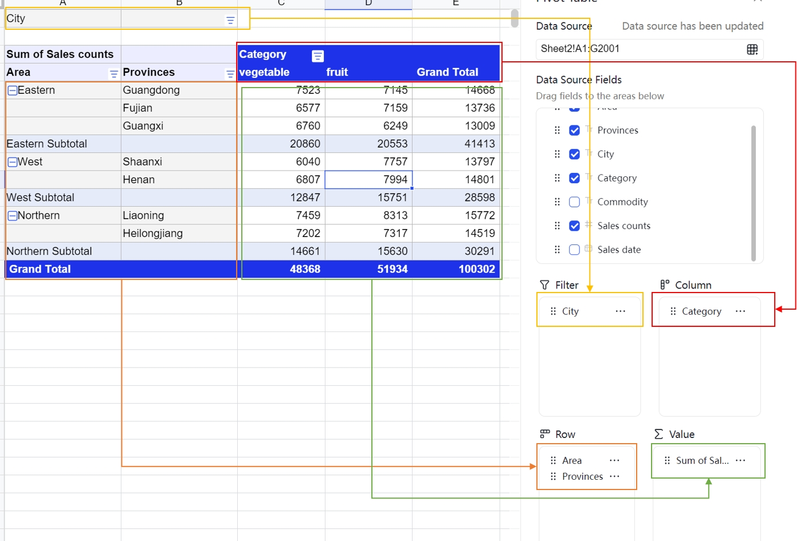

<MetaData
  lang="zh-TW"
  isPro
  meta={{
    preset: [{
      client: '@univerjs/preset-sheets-advanced',
      locale: '@univerjs/preset-sheets-advanced/locales/zh-TW',
      style: '@univerjs/preset-sheets-advanced/lib/index.css',
    }],
    plugins: [{
      client: '@univerjs-pro/sheets-pivot',
      facade: '@univerjs-pro/sheets-pivot/facade',
      locale: '@univerjs-pro/sheets-pivot/locale/zh-TW',
    }, {
      client: '@univerjs-pro/sheets-pivot-ui',
      locale: '@univerjs-pro/sheets-pivot-ui/locale/zh-TW',
      style: '@univerjs-pro/sheets-pivot-ui/lib/index.css',
    }],
    server: false,
  }}
/>

資料透視表是一種強大的資料分析工具，允許使用者快速彙總、分析和視覺化大量資料。它支援多種資料操作和格式設定選項，幫助使用者更直觀地理解資料。

## 簡介

資料透視表通常用於以下場景：

- 彙總資料：資料透視表可以幫助你快速彙總資料，以便更好地瞭解資料的整體情況。
- 分析資料：資料透視表可以幫助你分析資料，找出資料中的模式和關係。
- 探索資料：資料透視表可以幫助你探索資料，發現資料中的規律和趨勢。
- 視覺化資料：資料透視表可以幫助你將資料視覺化，以便更好地理解資料。

資料透視表通常包含以下幾個要素：

- 行標籤：資料透視表中的行標籤用於對資料進行分組。
- 列標籤：資料透視表中的列標籤用於對資料進行分組。
- 值：資料透視表中的值用於對資料進行彙總。

在資料透視表中，你可以根據需要對行標籤、列標籤和值進行調整，以便更好地分析資料。



### 資料來源

在 Univer Sheets 中，資料透視表的資料來源可以是一個工作表（Worksheet），也可以是一個資料區域。你可以根據需要選擇不同的資料來源，以便更好地分析資料。
我們會以資料來源的第一行作為預設的列標籤，其他部分作為資料來源。因此我們要求資料來源儘可能的歸整，儘可能避免空行，空列。
在同一列的資料中，我們會自動識別資料型別，以便更好的支援資料透視表的功能。假設在某一列中，資料型別不一致，我們會預設將該列的資料型別設定為字串。

在 Univer Sheets 中，資料透視表會自動響應資料的變化，當資料來源發生變化時，資料透視表會自動更新，以便更好地分析資料。

### 篩選

資料透視表支援對行標籤和列標籤進行篩選，同時提供篩選欄位，該欄位不會參與資料透視表主要資料分類彙總部分的排版，但是可以用於篩選資料。

資料透視表支援兩種篩選方式：
- 標籤篩選：標籤篩選是直接作用於當前標籤的維度的項（item）， 例如在省份維度下，我們可以過濾掉部分省份。
- 值篩選：值篩選需要指定一個值維度，然後會對值欄位的彙總結果進行篩選，例如我們可以過濾掉銷售額小於 1000 的資料。

### 排序

資料透視表的排序只會在行/列欄位生效，排序方式支援升序和降序，排序方式使用 localCompare 方式。後續我們會支援更多的排序方式，例如拼音排序。

資料透視表的排序支援兩種方式：
- 標籤排序：標籤排序是直接作用於當前標籤的維度的項（item）， 例如在省份維度下，我們可以按照省份名稱排序。
- 值排序：值排序需要指定一個值維度，然後會對值欄位的彙總結果進行排序，例如我們可以按照銷售額排序。

### 彙總

資料透視表支援 11 種 excel 支援的彙總方式，包括：求和、計數、資料計數、平均值、最大值、最小值、階乘、標準差、方差、總體標準差、總體方差。

資料透視表支援多個值維度，同時可以客製化多值維度所在區域（value position）和位置（value index）。

這是很複雜的排版邏輯， 因此我們僅支援了表格檢視，後續我們會根據情況支援更多的檢視。

### 下鑽

下鑽是指在資料透視表的值區域中，使用者可以透過雙擊某個單元格，檢視該單元格對應的詳細資料。例如，使用者可以在資料透視表中點選某個單元格，檢視該單元格的詳細資料，以便更好地追溯原資料。

### 分組

資料透視表支援分組功能，目前 Univer Sheets 尚未支援。

分組主要有以下三種方式：
- 日期分組：日期分組是指將日期資料按照年、月、日等單位進行分組。
- 數字分組：數字分組是指將數字資料按照一定的區間進行分組。
- 元素分組：元素分組是指將元素資料按照一定的規則進行分組。

## 預設模式

列印功能被包含在 `@univerjs/preset-sheets-advanced` 預設中。

### 安裝

<Callout>
  @univerjs/preset-sheets-advanced 的 `UniverSheetsAdvancedPreset` 預設在執行時依賴 `UniverSheetsDrawingPreset` 預設，請先安裝 @univerjs/preset-sheets-drawing。
</Callout>

```package-install
npm install @univerjs/preset-sheets-drawing @univerjs/preset-sheets-advanced
```

### 使用

```typescript
import { UniverSheetsAdvancedPreset } from '@univerjs/preset-sheets-advanced' // [!code ++]
import UniverPresetSheetsAdvancedZhTW from '@univerjs/preset-sheets-advanced/locales/zh-TW' // [!code ++]
import { UniverSheetsCorePreset } from '@univerjs/preset-sheets-core'
import UniverPresetSheetsCoreZhTW from '@univerjs/preset-sheets-core/locales/zh-TW'
import { UniverSheetsDrawingPreset } from '@univerjs/preset-sheets-drawing' // [!code ++]
import UniverPresetSheetsDrawingZhTW from '@univerjs/preset-sheets-drawing/locales/zh-TW' // [!code ++]
import { createUniver, LocaleType, mergeLocales } from '@univerjs/presets'

import '@univerjs/preset-sheets-core/lib/index.css'
import '@univerjs/preset-sheets-drawing/lib/index.css' // [!code ++]
import '@univerjs/preset-sheets-advanced/lib/index.css' // [!code ++]

const { univerAPI } = createUniver({
  locale: LocaleType.ZH_TW,
  locales: {
    [LocaleType.ZH_TW]: mergeLocales(
      UniverPresetSheetsCoreZhTW,
      UniverPresetSheetsDrawingZhTW, // [!code ++]
      UniverPresetSheetsAdvancedZhTW, // [!code ++]
    ),
  },
  presets: [
    UniverSheetsCorePreset(),
    UniverSheetsDrawingPreset(), // [!code ++]
    UniverSheetsAdvancedPreset(), // [!code ++]
  ],
})
```

如果你擁有 Univer 的商業許可證，請參考[在客戶端使用許可證](/guides/pro/license#在預設模式中使用)進行配置。

### 預設與配置

```typescript
interface IUniverSheetsAdvancedPresetConfig {
  pivot?: Pick<IUniverSheetsPivotConfig, 'maxLimitItemCount'>
}

interface IUniverSheetsPivotConfig {
  /**
   * 定義資料透視表中每個字段可顯示的最大項目數。
   * @default 1000
   */
  maxLimitItemCount?: number
}
```

## 外掛模式

### 安裝

```package-install
npm install @univerjs-pro/sheets-pivot @univerjs-pro/sheets-pivot-ui
```

### 使用

```typescript
import { UniverSheetsPivotTablePlugin } from '@univerjs-pro/sheets-pivot' // [!code ++]
import { UniverSheetsPivotTableUIPlugin } from '@univerjs-pro/sheets-pivot-ui' // [!code ++]
import SheetsPivotTableUIZhTW from '@univerjs-pro/sheets-pivot-ui/locale/zh-TW' // [!code ++]
import SheetsPivotTableZhTW from '@univerjs-pro/sheets-pivot/locale/zh-TW' // [!code ++]
import { LocaleType, mergeLocales, Univer } from '@univerjs/core'

import '@univerjs-pro/sheets-pivot-ui/lib/index.css' // [!code ++]

import '@univerjs-pro/sheets-pivot/facade' // [!code

const univer = new Univer({
  locale: LocaleType.ZH_TW,
  locales: {
    [LocaleType.ZH_TW]: mergeLocales(
      SheetsPivotTableZhTW, // [!code ++]
      SheetsPivotTableUIZhTW, // [!code ++]
    ),
  },
})
```

### 外掛註冊

透視表外掛支援針對不同的使用場景靈活註冊，提供兩種模式以適配不同的計算需求。

**單獨註冊在主程序**

透視表外掛可以單獨在主程序中註冊。這種模式適用於輕量級任務，操作簡單，無需額外配置外掛 config。開發者只需引入 `UniverSheetsPivotTablePlugin` 即可。

```typescript
univer.registerPlugin(UniverSheetsPivotTablePlugin)
univer.registerPlugin(UniverSheetsPivotTableUIPlugin)
```

**主程序和 worker 程序同時註冊**

對於需要高效能的場景，透視表外掛支援同時註冊在主程序和 worker 程序中。透過這種模式，外掛可以利用多執行緒架構實現高效的資料分發和計算處理，顯著減輕主程序的計算負擔，並提升整體效能。

在這種模式下，主程序主要負責資料的分發、同步和渲染，worker 程序專注於複雜的計算任務。為實現這一模式，需要在註冊時透過 config 進行精細化配置。

```typescript
// 瀏覽器主程序外掛註冊檔案
// notExecuteFormula 為 true 表示主程序不執行計算，只負責資料的分發、同步和渲染
univer.registerPlugin(UniverSheetsPivotTablePlugin, { notExecuteFormula: true })
univer.registerPlugin(UniverSheetsPivotTableUIPlugin)

// web worker 程序外掛註冊檔案
// notExecuteFormula 為 false 表示 worker 程序執行計算
univer.registerPlugin(UniverSheetsPivotTablePlugin, { notExecuteFormula: false })
```

如果你擁有 Univer 的商業許可證，請參考[在客戶端使用許可證](/guides/pro/license#在外掛模式中使用)進行配置。

### 外掛與配置

```typescript
interface IUniverSheetsPivotConfig {
  /**
   * 定義資料透視表中每個字段可顯示的最大項目數。
   * @default 1000
   */
  maxLimitItemCount?: number
}
```

## Facade API

完整 Facade API 型別定義，請檢視 [FacadeAPI](/reference/facade/univer)。

### 引入

<Callout type="info" title="外掛模式提示">
  僅外掛模式需要手動引入 Facade 套件。預設模式已內建對應的 Facade 套件，無需額外引入。
</Callout>

```typescript
import '@univerjs-pro/sheets-pivot/facade'
```

### 新增透視表

[`FWorkbook.addPivotTable`](https://docs.univer.ai/reference/facade/workbook#addpivottable) 方法用於新增透視表，成功會返回 `FPivotTable` 例項。

```typescript
// 需要確保工作表範圍 A1:G9 是非空的
const fWorkbook = univerAPI.getActiveWorkbook()
const unitId = fWorkbook.getId()
const fSheet = fWorkbook.getActiveSheet()
const subUnitId = fSheet.getSheetId()
const sheetName = fSheet.getSheetName()
const sourceInfo = {
  unitId,
  subUnitId,
  sheetName,
  range: {
    startRow: 0,
    startColumn: 0,
    endRow: 8,
    endColumn: 6,
  },
}
const anchorCellInfo = {
  unitId,
  subUnitId,
  row: 20,
  col: 8,
}
const fPivotTable = await fWorkbook.addPivotTable(sourceInfo, univerAPI.Enum.PositionTypeEnum.Existing, anchorCellInfo)
const pivotTableId = fPivotTable.getPivotTableId()
// 設定狀態，避免重複新增維度
let hasAdded = false
// 透視表的建立是非同步的，因此需要等待透視表渲染完成後再新增維度
univerAPI.addEvent(univerAPI.Event.PivotTableRendered, (params) => {
  if (!hasAdded && params.pivotTableId === pivotTableId) {
    fPivotTable.addField(1, univerAPI.Enum.PivotTableFiledAreaEnum.Row, 0)
    fPivotTable.addField(1, univerAPI.Enum.PivotTableFiledAreaEnum.Value, 0)
    hasAdded = true
  }
})
```

### 獲取透視表

[`FWorkbook.getPivotTableByCell`](https://docs.univer.ai/reference/facade/workbook#getpivottablebycell) 方法透過錨定單元格獲取透視表例項。如果目標單元格在透視表中，它將返回 `FPivotTable` 例項。

```typescript
const fWorkbook = univerAPI.getActiveWorkbook()
const unitId = fWorkbook.getId()
const fSheet = fWorkbook.getActiveSheet()
const subUnitId = fSheet.getSheetId()

// 從 FWorkbook 中獲取透視表例項
const fPivotTable = fWorkbook.getPivotTableByCell(unitId, subUnitId, 0, 8)

// 從 FSheet 中獲取透視表例項
const pivotTable2 = fSheet.getPivotTableByCell(0, 8)
```

[`FPivotTable`](https://docs.univer.ai/reference/facade/pivot-table) 例項中有一些方法，可以用來操作透視表。

| 方法                                                                                                                           | 描述                                                                    |
| ------------------------------------------------------------------------------------------------------------------------------ | ---------------------------------------------------------------------- |
| [remove](https://docs.univer.ai/reference/facade/pivot-table#remove)                             | 刪除透視表例項                                                          |
| [getConfig](https://docs.univer.ai/reference/facade/pivot-table#getconfig)                       | 獲取當前透視表的配置資訊，其中包括資料來源範圍，錨定單元格， 維度配置資訊      |
| [addField](https://docs.univer.ai/reference/facade/pivot-table#addfield)                         | 新增一個維度                                                            |
| [removeField](https://docs.univer.ai/reference/facade/pivot-table#removefield)                   | 刪除一個維度                                                            |
| [updateFieldPosition](https://docs.univer.ai/reference/facade/pivot-table#updatefieldposition)   | 更新維度的所在區域以及順序                                               |
| [updateValuePosition](https://docs.univer.ai/reference/facade/pivot-table#updatevalueposition)   | 更新 ∑Value 的位置                                                      |
| [setSubtotalType](https://docs.univer.ai/reference/facade/pivot-table#setsubtotaltype)           | 設定彙總方式                                                            |
| [setLabelSort](https://docs.univer.ai/reference/facade/pivot-table#setlabelsort)                 | 設定標籤排序                                                            |
| [setLabelManualFilter](https://docs.univer.ai/reference/facade/pivot-table#setlabelmanualfilter) | 設定標籤篩選                                                            |
| [renameField](https://docs.univer.ai/reference/facade/pivot-table#renamefield)                   | 重新命名維度                                                              |
| [setValueFilter](https://docs.univer.ai/reference/facade/pivot-table#setValueFilter)             | 設定值維度                                                              |
| [reset](https://docs.univer.ai/reference/facade/pivot-table#reset)                               | 重置透視表的維度配置                                                    |
| [setFieldsConfig](https://docs.univer.ai/reference/facade/pivot-table#setfieldsconfig)           | 設定透視表的維度配置                                                    |
| [getValueFilters](https://docs.univer.ai/reference/facade/pivot-table#getvaluefilters)           | 獲取透視表的值維度配置                                                  |

```typescript
class FPivotTable {
/**
 * @description Get the pivot table config by the pivot table id.
 * @typedef PivotTableConfig
 * @property {TargetInfo} targetCellInfo  The target cell info of the pivot table.
 * @property {SourceInfo} sourceRangeInfo The source data range info of the pivot table.
 * @property {boolean} isEmpty The pivot table is empty or not.
 * @property {object} fieldsConfig The snapshot of the pivot table fields config.
 * @returns {PivotTableConfig|undefined} The pivot table config or undefined.
 */
  getConfig(): IPivotTableConfig
  /**
   * @description Remove a pivot table from the workbook by pivot table id
   */
  async remove(): void
  /**
   *@description Add a pivot field to the pivot table.
   * @param {string|number} dataFieldIdOrIndex The data field id.
   * @param {PivotTableFiledAreaEnum} fieldArea The area of the field.
   * @param {number} index The index of the field in the target area.
   * @returns {boolean} Whether the pivot field is added successfully.
   */
  async addField(dataFieldIdOrIndex: string | number, fieldArea: PivotTableFiledAreaEnum, index: number): Promise<boolean>
  /**
   * @description Remove a pivot field from the pivot table
   * @param {string[]} fieldIds The deleted field ids.
   * @returns {boolean} Whether the pivot field is removed successfully.
   */
  async removeField(fieldIds: string[]): Promise<boolean>
  /**
   * @description Update the pivot table field position.
   * @param {string} fieldId - The moved field id.
   * @param {PivotTableFiledAreaEnum} area - The target area of the field.
   * @param {number} index - The target index of the field, if the index is bigger than the field count in the target area, the field will be moved to the last, if the index is smaller than 0, the field will be moved to the first.
   * @returns {boolean} Whether the pivot field is moved successfully.
   */
  async updateFieldPosition(fieldId: string, area: PivotTableFiledAreaEnum, index: number): Promise<boolean>
  /**
   * @description If there are multiple value fields in the pivot table, you can update the position of the value field, which only can be position in row or column.
   * @param {PivotTableValuePositionEnum} position - The position of the value field.
   * @param {number} index - The index of the value field.
   * @returns {boolean} Whether the pivot value field is moved successfully.
   */
  async updateValuePosition(position: PivotTableValuePositionEnum, index: number): Promise<boolean>
  /**
   * @description Set the pivot table subtotal type for value field, it only works for the value field.
   * @param {string} fieldId - The field id.
   * @param {PivotSubtotalTypeEnum} subtotalType - The subtotal type of the field.
   * @returns {boolean} Whether the pivot table subtotal type is set successfully.
   */
  async setSubtotalType(fieldId: string, subtotalType: PivotSubtotalTypeEnum): Promise<boolean>
  /**
   * @description Set the pivot table sort info.
   * @param {string} tableFieldId - The field id of the sort.
   * @param {PivotTableSortInfo} info - The sort info.
   * @typedef PivotTableSortInfo
   * @property {PivotDataFieldSortOperatorEnum} type The sort operator of the field items.
   * @returns {boolean} Whether the pivot table sort info is set successfully.
   */
  async setLabelSort(tableFieldId: string, info: IPivotTableSortInfo): Promise<boolean>
  /**
   * @description Set the pivot table filter.
   * @param {string} tableFieldId - The field id of the filter.
   * @param {string[]} items - The items of the filter.
   * @returns {boolean} Whether the pivot table filter is set successfully.
   */
  async setLabelFilter(tableFieldId: string, items: string[], isAll?: boolean): Promise<boolean>
  /**
   * @description Rename the pivot table field.
   * @param {string} fieldId - The field id.
   * @param {string} name - The new name of the field.
   * @returns {boolean} Whether the pivot table field is renamed successfully.
   */
  async renameField(fieldId: string, name: string): Promise<boolean>
  /**
   * @description Set the pivot table value filter. A value filter is used to filter the data based on the value of a field.
   * @param {string} fieldId - The field id of the filter. Only one value filer can be set for a field.
   * @param {Omit<IPivotTableValueFilter, 'type'>} filterInfo - The filter info. The undefined value will be removed from the old filter.
   * @typedef filterInfo
   * @property {valueGreaterThan} operator - The filter operator is used to compare the value of the field with the expected value.Currently, The following operators are supported: valueBetween, valueEqual, valueGreaterThan, valueGreaterThanOrEqual, valueLessThan, valueLessThanOrEqual,valueNotBetween,valueNotEqual.
   * @property {number} expected - The expected value.
   * @property {string} valueFieldId - The value field id.
   * @returns {boolean} Whether the pivot table value filter is set successfully.
   */
  async setValueFilter(fieldId: string, filterInfo: Omit<IPivotTableValueFilter, 'type'>): Promise<boolean>
  /**
   * @description Clear the fields by provided field area or clear all fields.
   * @param {PivotTableFiledAreaEnum} [resetArea] The area of the field to reset or undefined to reset all fields.
   * @returns {Promise<boolean>} Whether the pivot table fields are reset successfully.
   */
  reset(resetArea?: PivotTableFiledAreaEnum): Promise<boolean>
  /**
   * @description Set the pivot table fields config.It will add fields to the pivot table from provided config.Before setting the fields config, you should ensure the pivot table is empty to avoid the conflict.
   * @param {IPivotTableConfig['fieldsConfig']} config The pivot table fields config.
   * @returns {Promise<boolean>} Whether the pivot table fields config is set successfully.
   */
  setFieldsConfig(config: IPivotTableConfig['fieldsConfig']): Promise<boolean>
  /**
   * Get all value filters of the pivot table. In pivot table, the value filter must be applied in order.So the order of the value filter is important.
   * @returns {IValueFilterInfoItem[]} The value filter info list.
   */
  getValueFilters(): IValueFilterInfoItem[]
}
```

### 事件監聽

完整事件型別定義，請檢視 [Events](https://docs.univer.ai/reference/facade/events)。

`univerAPI.Event.BeforePivotTableAdd` 事件在新增透視表之前觸發。

```typescript
const disposable = univerAPI.addEvent(univerAPI.Event.BeforePivotTableAdd, (params) => {
  const { positionType, targetCellInfo } = params
  if (positionType === univerAPI.Enum.PositionTypeEnum.Existing && targetCellInfo.sheetName === 'Sheet 1') {
    // 取消新增透視表操作
    params.cancel = true
    console.log(`無法將透視表新增到 ${targetCellInfo.sheetName} 工作表`)
  }
})

// 移除事件監聽器，使用 `disposable.dispose()`
```

`univerAPI.Event.PivotTableAdded` 事件在新增透視表之後觸發。

```typescript
const disposable = univerAPI.addEvent(univerAPI.Event.PivotTableAdded, (params) => {
  const { positionType, targetCellInfo } = params
  if (positionType === univerAPI.Enum.PositionTypeEnum.Existing) {
    console.log('在現有工作表中建立了一個透視表')
    console.log(`
      目標工作表名稱為 ${targetCellInfo.sheetName},
      目標行為 ${targetCellInfo.row}, 目標列為 ${targetCellInfo.column}
    `)
  } else {
    console.log('在新工作表中建立了一個透視表')
  }
})

// 移除事件監聽器，使用 `disposable.dispose()`
```

`univerAPI.Event.BeforePivotTableMove` 事件在移動透視表之前觸發。

```typescript
const disposable = univerAPI.addEvent(univerAPI.Event.BeforePivotTableMove, (params) => {
  const { pivotTableId, targetCellInfo } = params
  if (pivotTableId === 'pivotTable1' && targetCellInfo.sheetName === 'Sheet 1') {
    // 取消移動透視表操作
    params.cancel = true
    console.log(`無法將透視表移動到 ${targetCellInfo.sheetName} 工作表`)
  }
})

// 移除事件監聽器，使用 `disposable.dispose()`
```

`univerAPI.Event.PivotTableMoved` 事件在移動透視表之後觸發。

```typescript
const disposable = univerAPI.addEvent(univerAPI.Event.PivotTableMoved, (params) => {
  const { pivotTableId, targetCellInfo, originTargetInfo } = params
  if (pivotTableId === 'pivotTable1') {
    console.log(`
      透視表從行: ${originTargetInfo.row} & 列: ${originTargetInfo.column}
      移動到工作表 ${targetCellInfo.sheetName} 行: ${targetCellInfo.row} & 列: ${targetCellInfo.column}
    `)
  }
})

// 移除事件監聽器，使用 `disposable.dispose()`
```

`univerAPI.Event.PivotTableRendered` 事件在透視表渲染完成後觸發。

```typescript
// import { unionPivotViewRange } from '@univerjs-pro/sheets-pivot';
const disposable = univerAPI.addEvent(univerAPI.Event.PivotTableRendered, (params) => {
  const { pivotTableId, rangeInfo } = params
  console.log(`透視表 ${pivotTableId} 已渲染`)
  if (rangeInfo) {
    console.log(unionPivotViewRange(rangeInfo))
  }
})

// 移除事件監聽器，使用 `disposable.dispose()`
```

`univerAPI.Event.PivotTableRemoved` 事件在透視表被刪除後觸發。

```typescript
const disposable = univerAPI.addEvent(univerAPI.Event.PivotTableRemoved, (params) => {
  const { pivotTableId } = params
  console.log(`透視表 ${pivotTableId} 已被刪除`)
})

// 移除事件監聽器，使用 `disposable.dispose()`
```

`univerAPI.Event.PivotTableFieldAdded` 事件在透視表新增維度後觸發。

```typescript
const fWorkbook = univerAPI.getActiveWorkbook()
const disposable = univerAPI.addEvent(univerAPI.Event.PivotTableFieldAdded, (params) => {
  const { pivotTableId, fieldId, fieldArea, fieldIndex } = params
  const pivotTable = fWorkbook.getPivotTableById(pivotTableId)
  const fieldSetting = pivotTable.getFieldSetting('fieldId')
  console.log(fieldSetting)
})

// 移除事件監聽器，使用 `disposable.dispose()`
```

`univerAPI.Event.PivotTableFieldRemoved` 事件在透視表刪除維度後觸發。

```typescript
const fWorkbook = univerAPI.getActiveWorkbook()
const disposable = univerAPI.addEvent(univerAPI.Event.PivotTableFieldRemoved, (params) => {
  const { pivotTableId, fieldId } = params
  const pivotTable = fWorkbook.getPivotTableById(pivotTableId)
  const fieldSetting = pivotTable.getFieldSetting(fieldId)
  console.log(fieldSetting)
})

// 移除事件監聽器，使用 `disposable.dispose()`
```

`univerAPI.Event.PivotTableFieldMoved` 事件在透視表移動維度後觸發。

```typescript
const fWorkbook = univerAPI.getActiveWorkbook()
const disposable = univerAPI.addEvent(univerAPI.Event.PivotTableFieldMoved, (params) => {
  const { pivotTableId, fieldId, fieldArea, fieldIndex } = params
  const pivotTable = fWorkbook.getPivotTableById(pivotTableId)
  const fieldSetting = pivotTable.getFieldSetting(fieldId)
  console.log(`源名稱 ${fieldSetting.sourceName} 顯示名稱 ${fieldSetting.displayName}`)
})

// 移除事件監聽器，使用 `disposable.dispose()`
```

`univerAPI.Event.PivotTableFieldCollapseChanged` 事件在透視表展開/摺疊維度後觸發。

```typescript
const fWorkbook = univerAPI.getActiveWorkbook()
const disposable = univerAPI.addEvent(univerAPI.Event.PivotTableFieldCollapseChanged, (params) => {
  const { pivotTableId, fieldId, isCollapsed } = params
  const pivotTable = fWorkbook.getPivotTableById(pivotTableId)
  const fieldSetting = pivotTable.getFieldSetting(fieldId)
  console.log(`源名稱 ${fieldSetting.sourceName} 顯示名稱 ${fieldSetting.displayName}`)
})

// 移除事件監聽器，使用 `disposable.dispose()`
```

`univerAPI.Event.PivotTableFieldFilterChanged` 事件在透視表維度篩選後觸發。

```typescript
const fWorkbook = univerAPI.getActiveWorkbook()
const disposable = univerAPI.addEvent(univerAPI.Event.PivotTableFieldFilterChanged, (params) => {
  const { pivotTableId, fieldId, filter } = params
  const pivotTable = fWorkbook.getPivotTableById(pivotTableId)
  const fieldSetting = pivotTable.getFieldSetting(fieldId)
  console.log(`檢查列表篩選值為 ${fieldSetting.filterInfo.checklist}`)
})

// 移除事件監聽器，使用 `disposable.dispose()`
```

`univerAPI.Event.PivotTableFieldSortChanged` 事件在透視表維度排序後觸發。

```typescript
const fWorkbook = univerAPI.getActiveWorkbook()
const disposable = univerAPI.addEvent(univerAPI.Event.PivotTableFieldSortChanged, (params) => {
  const { pivotTableId, fieldId, sort } = params
  const pivotTable = fWorkbook.getPivotTableById(pivotTableId)
  const fieldSetting = pivotTable.getFieldSetting(fieldId)
  console.log(`排序資訊為 ${fieldSetting.sortInfo}`)
})

// 移除事件監聽器，使用 `disposable.dispose()`
```

`univerAPI.Event.PivotTableFieldSettingChanged` 事件在透視表維度設定變更後觸發。

```typescript
const fWorkbook = univerAPI.getActiveWorkbook()
const disposable = univerAPI.addEvent(univerAPI.Event.PivotTableFieldSettingChanged, (params) => {
  const { pivotTableId, fieldId, setting } = params
  const pivotTable = fWorkbook.getPivotTableById(pivotTableId)
  const fieldSetting = pivotTable.getFieldSetting(fieldId)
  console.log(`源名稱 ${fieldSetting.sourceName} 顯示名稱 ${fieldSetting.displayName}`)
})

// 移除事件監聽器，使用 `disposable.dispose()`
```

`univerAPI.Event.PivotTableValuePositionChanged` 事件在透視表值位置變更後觸發。

```typescript
const fWorkbook = univerAPI.getActiveWorkbook()
const disposable = univerAPI.addEvent(univerAPI.Event.PivotTableValuePositionChanged, (params) => {
  const { pivotTableId, valueId, position } = params
  const pivotTable = fWorkbook.getPivotTableById(pivotTableId)
  const valueSetting = pivotTable.getValueSetting(valueId)
  console.log(`源名稱 ${valueSetting.sourceName} 顯示名稱 ${valueSetting.displayName}`)
})

// 移除事件監聽器，使用 `disposable.dispose()`
```
