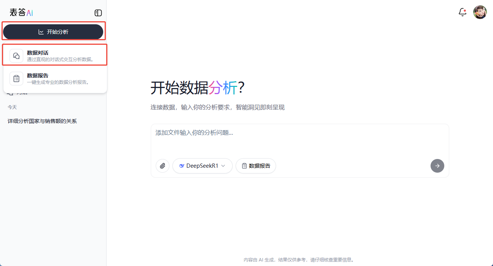
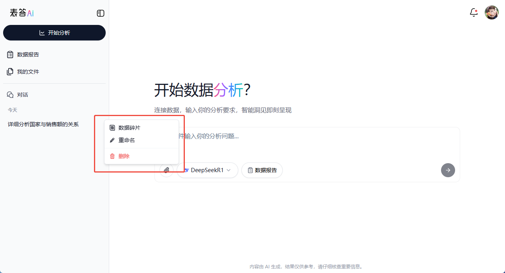
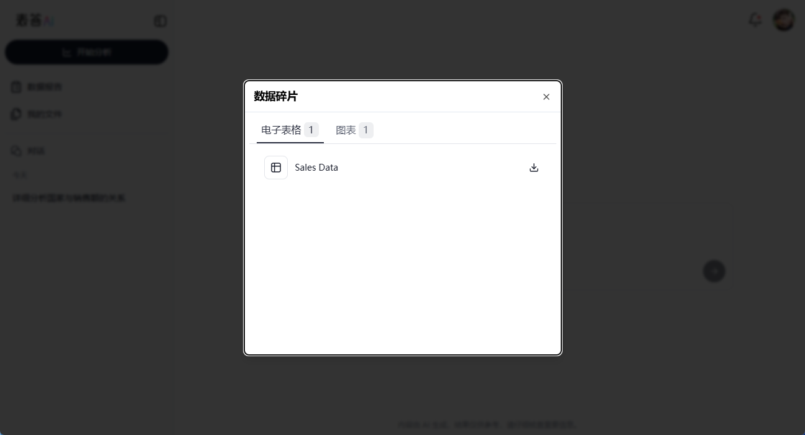

# 会话管理

在使用 表答 AI 进行数据分析时，用户往往需要多次对话、查看历史记录、切换或删除会话。会话管理功能能够帮助你更好地组织和追踪所有对话内容。通过会话管理，你可以新建会话、查看历史聊天记录、重命名或删除会话，并快速跳转到当前会话绑定的表格文档，提升工作效率。

## 功能概述

会话管理功能主要涵盖以下几个方面：

- **新建会话**：在需要开始一段新的数据分析或话题讨论时，随时创建新的会话。  
- **查看历史记录**：在侧边栏查看以往的所有会话，支持折叠或展开列表，便于快速查找。  
- **跳转关联文档**：在查看历史会话时，可一键跳转到与当前会话绑定的 Excel/CSV 文档或 Univer Sheet。  
- **重命名与删除**：当会话过多或名称不够直观时，可进行重命名或删除操作，删除后相关文档也会一并删除。  

通过这些功能，表答 AI 为用户提供了更加灵活与高效的对话管理体验。

## 新建会话

当你需要开始一段全新的分析或与新的数据源进行对话时，可以通过以下方式新建会话：

**在侧边栏新建会话**  
- 展开左侧侧边栏后，点击 **“新建对话”** 按钮，即可创建一条全新的会话。  
- 系统会自动进入该新会话的聊天界面，后续的所有交互都将保存在这条会话下。

> **提示**：新建会话能够帮助你分清不同主题或场景下的分析需求，避免将不同领域的数据混在同一个聊天中，从而保持思路清晰。

## 查看历史聊天记录

### 侧边栏折叠与展开

- 当你需要专注于当前会话时，可以将侧边栏折叠，以获得更大的主界面视图。  
- 当你需要切换会话或查看历史记录时，只需点击侧边栏的折叠/展开按钮，即可快速切换侧边栏的显示状态。

### 历史会话列表

- 在侧边栏展开后，你会看到一个按时间顺序排列的 **历史会话列表**。  
- 每条历史会话会显示简要标题，点击后即可进入对应的对话内容，查看上下文记录和分析结果。

### 跳转到当前对话绑定的 Sheet

- 在历史会话中，如果某条会话曾绑定过某个 Univer Sheet（例如，你曾经上传过某个 Excel 并进行分析），点击该会话名称右侧的更多按钮，你会看到下拉菜单中的 **“电子表格”**。
- 点击该按钮会出现一个弹出框，可以查看对话中的所有 Univer 表格
    - 点击表格名称支持跳转到表格所在的会话并展示表格
    - 支持下载 Univer 表格
    - 支持分享 Univer 表格

|下拉选项 Univer 表格|查看对话中的所有 Univer 表格|
|---|---|
||

## 管理会话

### 重命名会话

- 如果会话数量较多或名称不够直观，你可以通过 **重命名** 功能来对其进行区分。  
- 在侧边栏的历史会话列表中，找到目标会话，点击右侧更多按钮，点击 **“重命名”**，即可为会话输入新的名称。

### 删除会话

- 当某条会话不再需要时，你可以选择将其删除。  
- **删除会话后，相关文档也会一并删除**，因此在删除前务必确认会话和文档中不再有重要数据。  
- 在侧边栏历史会话列表中，找到目标会话，点击右侧更多按钮，点击 **“删除”** 即可完成操作。

> **注意**：删除操作不可逆，如果会话中包含重要的分析结果或文档，请先行备份或下载。

## 常见问题

1. **无法查看历史记录怎么办？**  
   - 检查侧边栏是否处于折叠状态。  
   - 确保网络正常并且登录状态未过期，如果账号已退出或网络不稳定，可能导致历史记录无法加载。

2. **删除会话后还能恢复吗？**  
   - 当前版本中，一旦删除会话，所有相关数据和文档都会被彻底移除，暂时无法恢复。  
   - 建议在删除前备份关键数据或导出相关文档。

3. **如何快速区分不同会话？**  
   - 合理使用 **重命名** 功能，为会话取一个具有标识性的名称，例如“销售数据分析-2023Q1”或“客户满意度调查-回访计划”。  
   - 若会话过多，可定期整理和删除无用会话，保持会话列表简洁。

通过合理使用会话管理功能，你可以在 表答 AI 中高效地组织和检索历史分析内容，节省在不同任务间来回切换的时间。立即前往 [表答 AI](http://biaoda.me/) 体验更便捷的会话管理功能吧！
