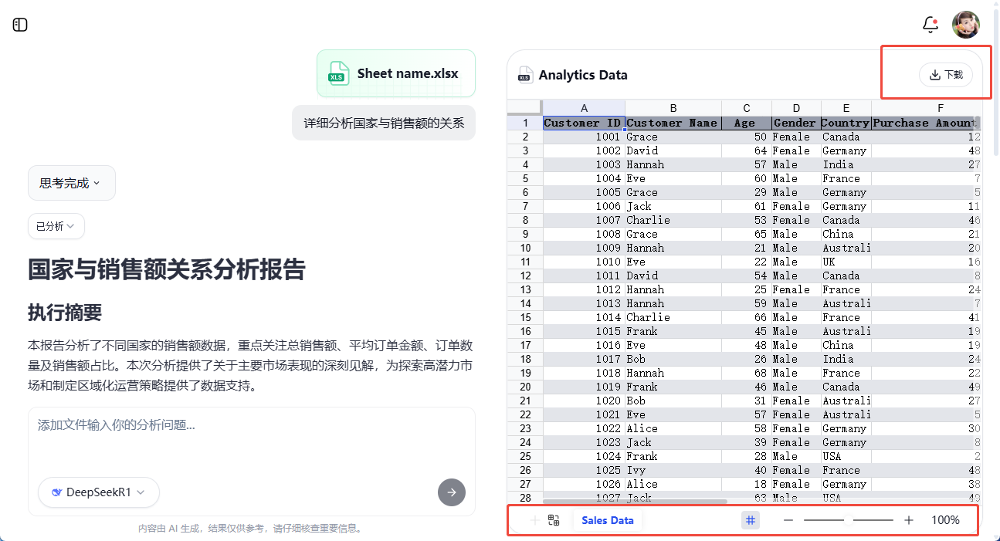

# 文件预览

## 功能概述

表答 AI 提供了强大的 **文件预览** 功能，帮助你在对话中快速查看并分析上传的 Excel 或 CSV 数据。通过自动将文件导入为 **Univer Sheet**，你可以在会话界面直接切换工作表、选取单元格、分享数据、导出结果，极大提升数据处理的效率。

**核心优势：**  
- **一键导入**：上传 Excel 文件后，系统自动解析并创建 Univer Sheet。  
- **实时预览**：在同一个对话窗口中即可预览表格。  
- **高效协同**：支持分享与下载，让团队协作更便捷。  

## 上传 Excel 并自动导入

在进入 [表答 AI](http://biaoda.me/) 的对话页面后，你可以按照以下步骤上传 Excel 文件：

1. **点击“＋”按钮**：在对话输入框左下角，你会看到一个“＋”图标，点击它即可打开上传菜单。  
2. **选择文件**：从本地计算机中选择要上传的 Excel 或 CSV 文件。  
3. **自动解析**：系统会自动读取并高亮表格内容，并生成对应的 Univer Sheet，展示在对话窗口中。  

上传完成后，你可以在会话的对话气泡中看到表格的预览图，并在其上方的工具栏中进行进一步操作。

## Univer Sheet 与当前会话绑定

当你在会话中上传了一个 Excel 文件并成功解析为 Univer Sheet 后，该 Sheet 会与当前会话 **一一绑定**：

- **一份文件，多次调用**：在同一个会话中，如果需要多次对这份数据进行分析，无需重复上传。  
- **独立的会话空间**：每次新建会话时，你可以上传新的文件，或在已有会话中继续操作之前的文件。  
- **持久记录**：只要会话没有被删除，Univer Sheet 的内容都会被保留，你可以随时回到历史记录进行查看或二次分析。  

## 预览功能详解

当表格被成功解析后，你将在对话窗口看到类似下图的预览界面。该界面提供多种功能，帮助你快速定位并分析数据。

### 单元格框选

- 通过 **鼠标** 或 **拖拽手势**，可以在预览区域中框选某些单元格，以进行重点标记。  

### 下载 Excel

- 在完成对数据的分析后，你可以随时将当前工作表导出为 Excel 文件。  
- 点击 **“下载”** 按钮后，系统会打包生成 .xlsx 文件，保存到你的本地计算机，便于后续归档或离线查看。  

### 切换 Sheet

- 在 Excel 中常常会包含多个工作表（Sheet）。  
- 通过预览界面下方的 **Sheet 列表**，你可以快速切换到所需的工作表。  
- 当你选择不同的 Sheet 时，预览区域会立即更新显示该工作表的内容。  

## 常见问题

- **如何处理大规模表格数据？**  
  表答 AI 采用了高性能的表格解析引擎，能够处理数万行数据，但如果表格过于庞大，可能需要稍作等待或考虑拆分文件上传。  

## 体验入口

以上就是 表答 AI 文件预览功能的核心介绍，借助这些功能，你可以轻松管理、预览和分析 Excel 数据。  
立即访问 [表答 AI](http://biaoda.me/) 进行体验，尝试上传你的 Excel 文件，感受全新的智能预览与数据分析模式吧！  
