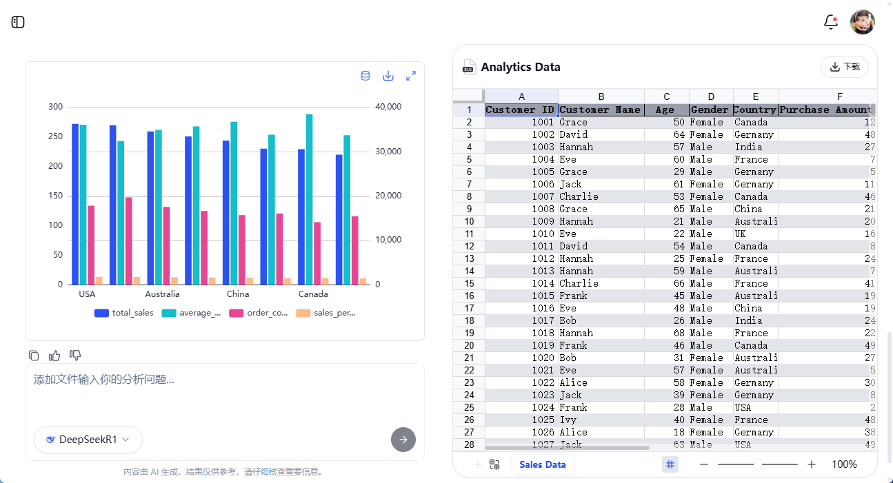

# 基本使用

## 开启智能对话

访问 [表达 AI](http://biaoda.me/)，点击立即开始，即可进入 表答 AI 的智能对话界面。

## 连接数据源

在对话输入框的左下角，点击“＋”按钮，即可上传 **Excel** 或 **CSV** 文件作为数据源。

系统会自动解析表格内容，并智能推荐适合的提示词，帮助你高效分析数据。例如：

- 研究 **各国产品偏好** 差异，优化库存管理  
- 聚合 **不同年龄段** 数据，评估用户满意度  

你也可以自由编辑提示词，自定义分析方向，然后点击 **“发送”** 开始交互。

## 智能数据分析

上传的数据会自动加上范围主题高亮，以便更清晰地识别表格中的关键信息。

表答 AI 将从多个维度对数据进行深入解析，提供丰富的分析视角：

- **分析目标**：明确此次分析的核心目标，例如识别销售趋势、优化客户关系管理等。  
- **结果数据**：生成关键数据表格，如销售趋势、客户群体特征分析等。  
- **数据可视化**：基于分析结果，自动生成直观的图表，如销售趋势图、用户分布图等。  
- **分析见解**：提供关键数据解读，例如识别销售高峰期，探究可能的市场因素。  
- **优化策略**：基于分析结果，给出提升业绩的建议，例如针对特定时间段进行促销活动，优化库存策略等。

| 分析目标 & 结果数据 | 数据可视化 | 分析见解 & 策略 |
|---|---|---|
|  |  |  |

表答 AI 让数据分析变得更直观、更高效，助你快速获得有价值的商业洞察！ 🚀

立即体验 [表答 AI](http://biaoda.me/)
