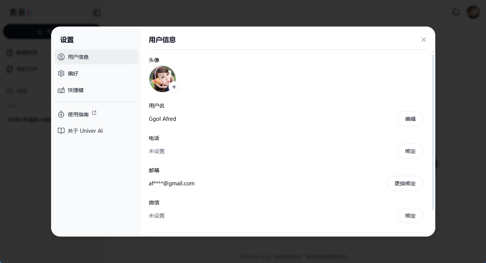

# 用户个性化设置

本文将详细介绍如何在 表答 AI 中进行个性化设置，以优化你的使用体验。

## 访问个性化设置

点击界面右上角的用户头像，即可展开设置菜单。

## 语言切换

表答 AI 支持简体中文和英文两种语言切换。

### 切换步骤

1. 点击右上角头像。
2. 将鼠标悬停在“Language（语言）”选项。
3. 从展开的子菜单中选择你希望使用的语言（简体中文或English）。

选择完成后，界面语言将立即更新。

## 退出登录

如需退出当前账户，确保数据安全，按照以下步骤操作：

1. 点击右上角头像。
2. 点击下拉菜单中的“Log Out（退出登录）”选项。

点击后，你将返回 表答 AI 首页，需要重新登录才能再次访问。

通过以上设置步骤，轻松实现 表答 AI 的个性化管理，让你的数据分析体验更加便捷和舒适！
