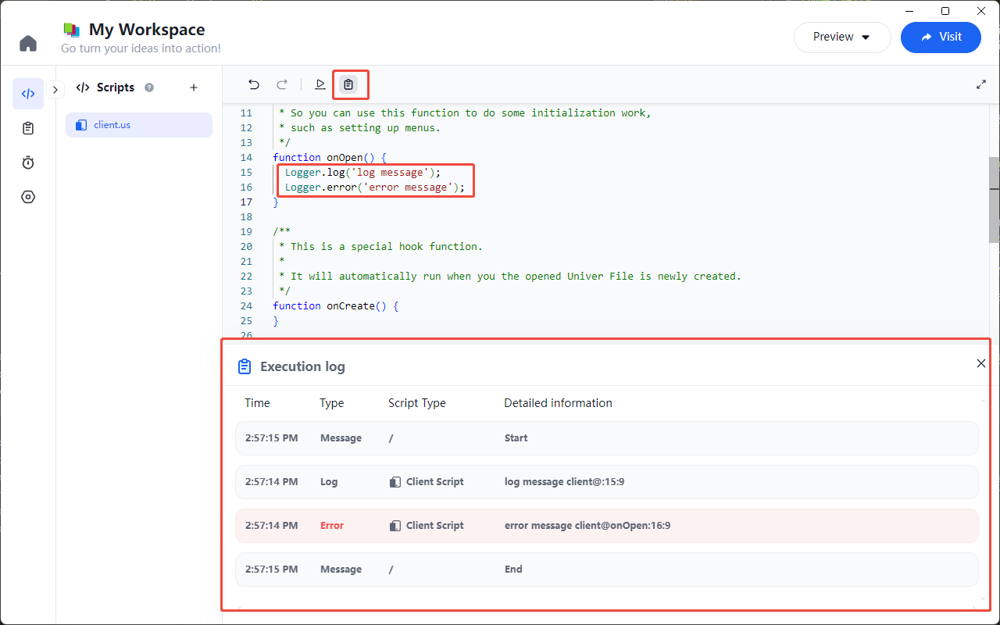
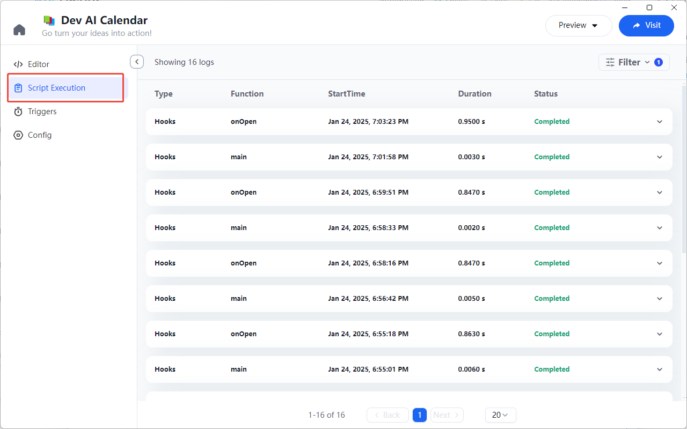
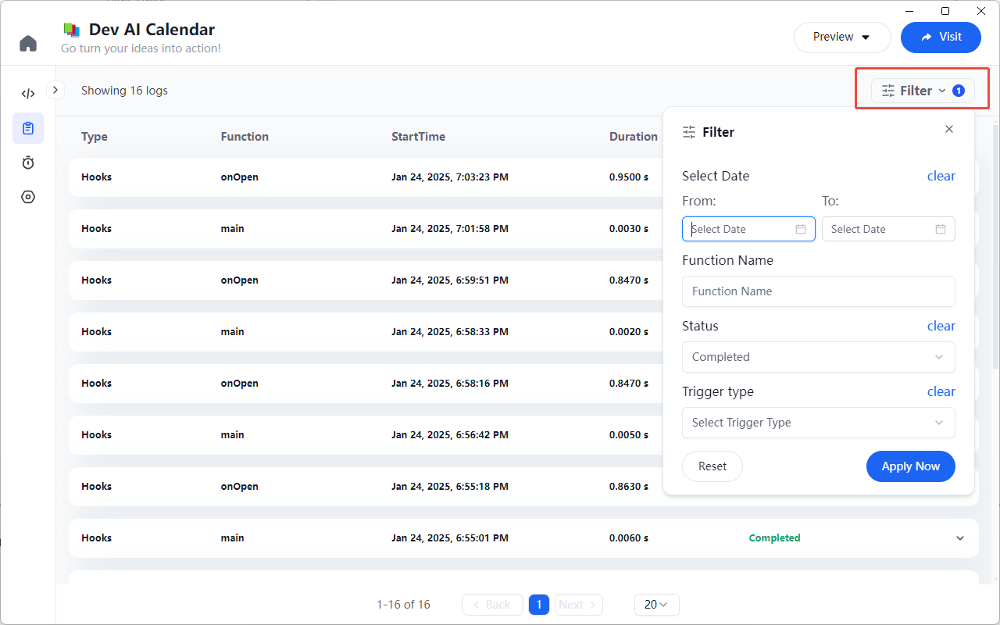

# 日志

Univer Go 提供了执行过程中的日志输出功能，方便用户查看脚本执行过程中的信息。

## 日志类的使用

在脚本中，可以通过 `Logger` 类的方法输出日志信息。

### 日志级别

日志级别分为 `Logger.log` 和 `Logger.error` 两个级别

- `Logger.log`：输出普通日志
- `Logger.error`：输出错误日志

### 日志输出

在脚本的任意执行位置，都可以输出日志信息。

比如在 `onOpen` 函数中输出日志：
```js
function onOpen() {
  Logger.log('log messge');
  Logger.error('error message');
}
```

执行完脚本，编辑器下方即会出现日志面板



## 日志列表

除了在编辑器中查看日志，还可以在 Workspace 左侧的日志列表中查看。

在日志列表中，可以查看日志的类型、执行函数、开始时间、持续时间、状态等信息。



## 日志筛选

如果日志列表中的日志过多，可以通过日志筛选功能，筛选出符合条件的日志。

日志筛选器支持按日志时间范围、函数名、执行结果、触发源等条件进行筛选。

