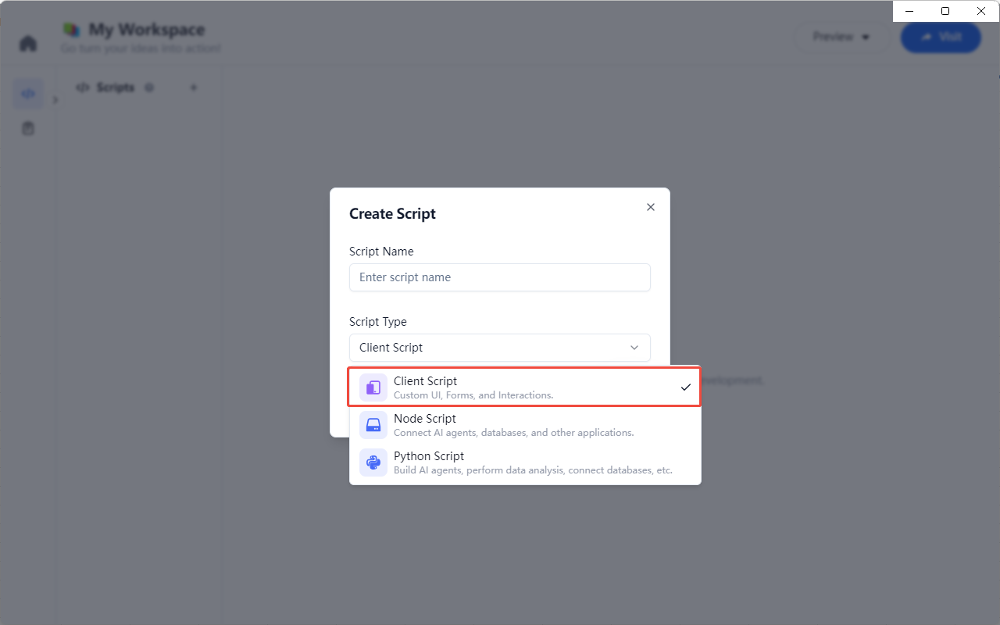
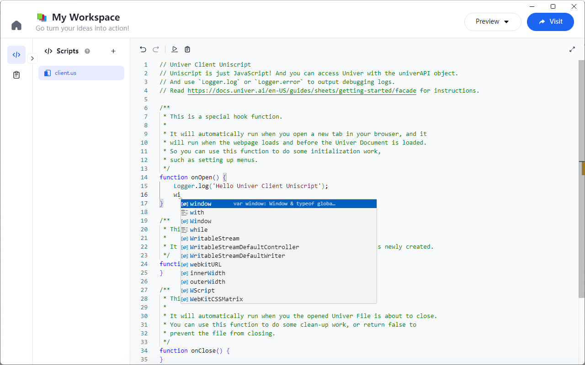
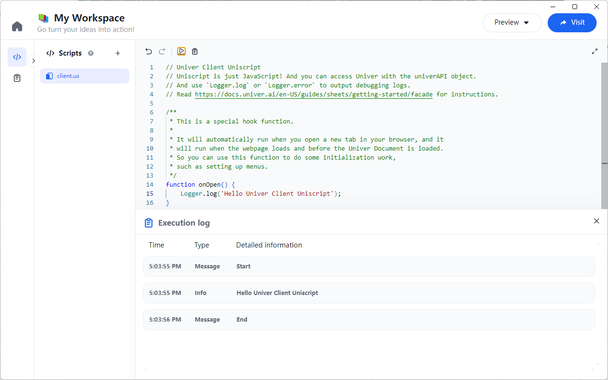
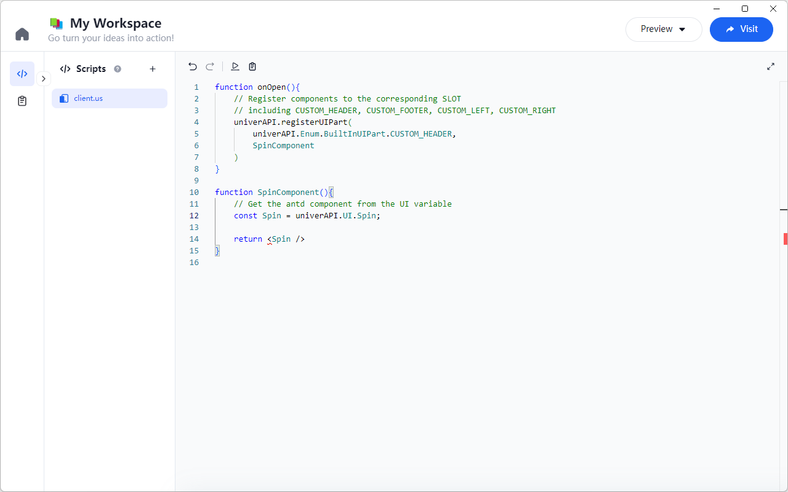
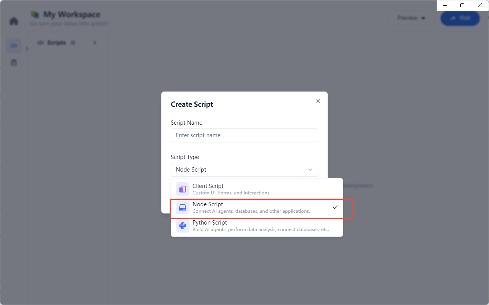
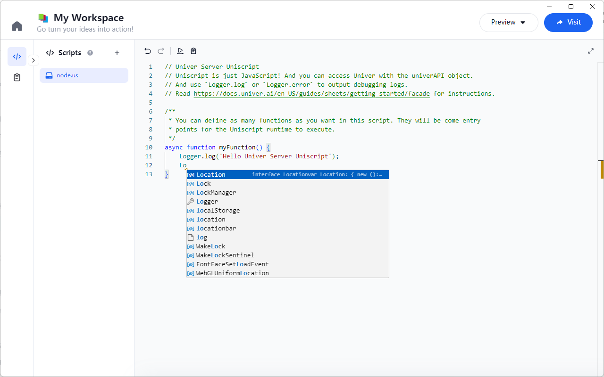
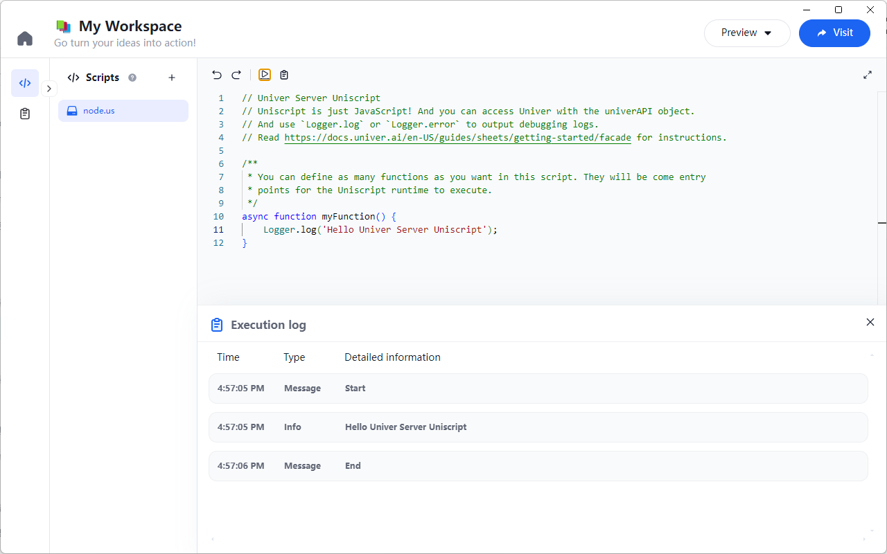
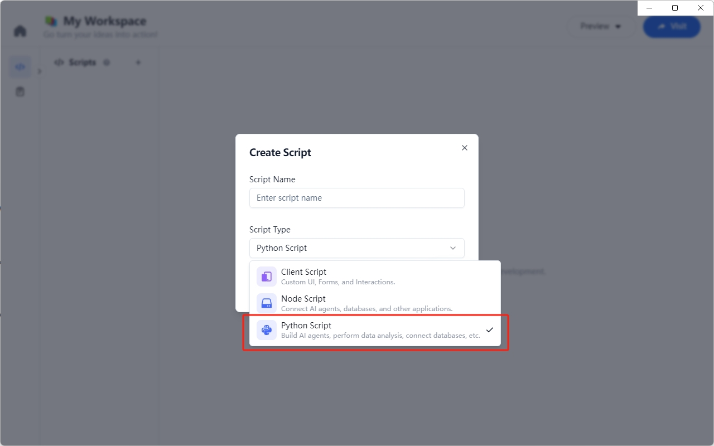
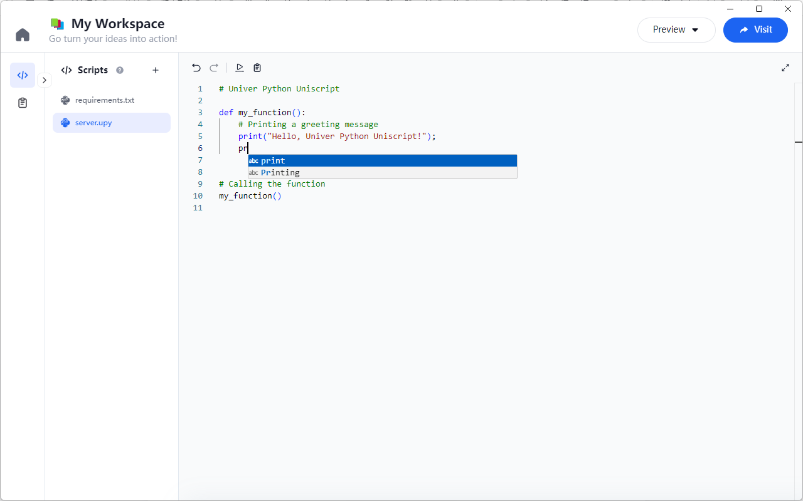
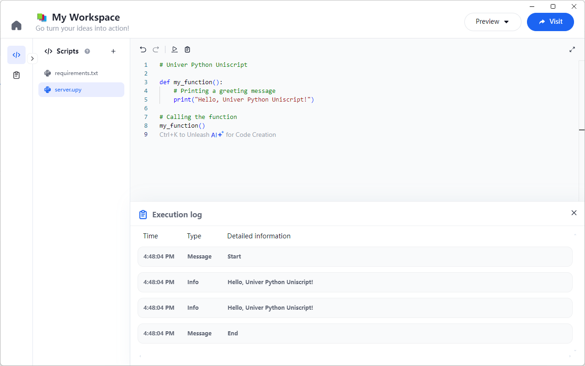

# 脚本

## Client 脚本

### 如何创建

在 Workspace 中，点击 `+` 按钮，选择 `Client` 脚本类型，即可创建一个 Client 脚本。



### 如何编辑

点击 Client 脚本，即可进入编辑器，编辑器支持 JavaScript 语法高亮、代码提示等功能。




#### univerAPI
在 Client 脚本中，可以直接使用 `univerAPI` 对象，该对象提供了一些常用的 API，比如：

```js
function onOpen() {
  const workbook = univerAPI.getActiveWorkbook();
  const sheet = workbook.getActiveSheet();
}
```

更多 API 详情，请参考 [Univer Sheets API](/zh-CN/guides/sheets/features/core/sheet-api)

#### runOnServer

在 Client 脚本中，可以使用 `runOnServer` 方法，调用 Server 脚本中的方法并获取返回值，比如：

```js
async function getServerData() {
  const answerData = await univerAPI.runOnServer('ai', 'gpt', `从“中国的首都是哪里？”中提取主题`);
  Logger.log('回答:', answerData);
}
```

第一个参数为 Server 脚本名称，第二个参数为 Server 脚本方法名，第三个参数为方法参数。

### 如何运行

编辑完成后，点击编辑器左上角的 `运行` 按钮，即可执行 Client 脚本，并打印输出结果。



### 支持 JSX 语法

Client 脚本支持 JSX 语法，可以在 Client 脚本中直接编写 JSX 组件，并注册到页面中。比如：

```js
function onOpen() {
  // 将组件注册到对应的插槽
  // 包括 CUSTOM_HEADER, CUSTOM_FOOTER, CUSTOM_LEFT, CUSTOM_RIGHT
  univerAPI.registerUIPart(
      univerAPI.Enum.BuiltInUIPart.CUSTOM_HEADER, 
      SpinComponent
  )
}

function SpinComponent() {
  // 从 UI 变量中获取 antd 组件
  const Spin = univerAPI.UI.Spin;

  return <Spin />
}
```



在页面中，即可看到注册的组件（左上角位置）。


## Node 脚本

### 如何创建

在 Workspace 中，点击 `+` 按钮，选择 `Node` 脚本类型，即可创建一个 Node 脚本。



### 如何编辑

点击 Node 脚本，即可进入编辑器，编辑器支持 Node.js 语法高亮、代码提示等功能。



### 如何运行

编辑完成后，点击编辑器左上角的 `运行` 按钮，即可执行 Node 脚本，并打印输出结果。



## Python 脚本

### 如何创建

在 Workspace 中，点击 `+` 按钮，选择 `Python` 脚本类型，即可创建一个 Python 脚本。



### 如何编辑

点击 Python 脚本，即可进入编辑器，编辑器支持 Python 语法高亮、代码提示等功能。



### 如何运行

编辑完成后，点击编辑器左上角的 `运行` 按钮，即可执行 Python 脚本，并打印输出结果。


