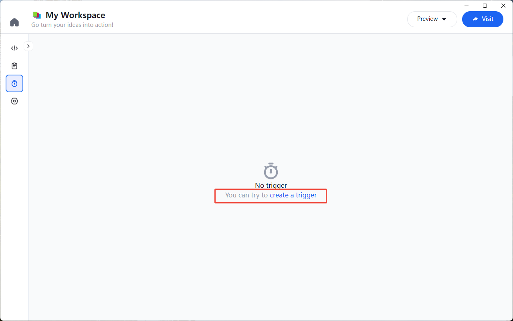
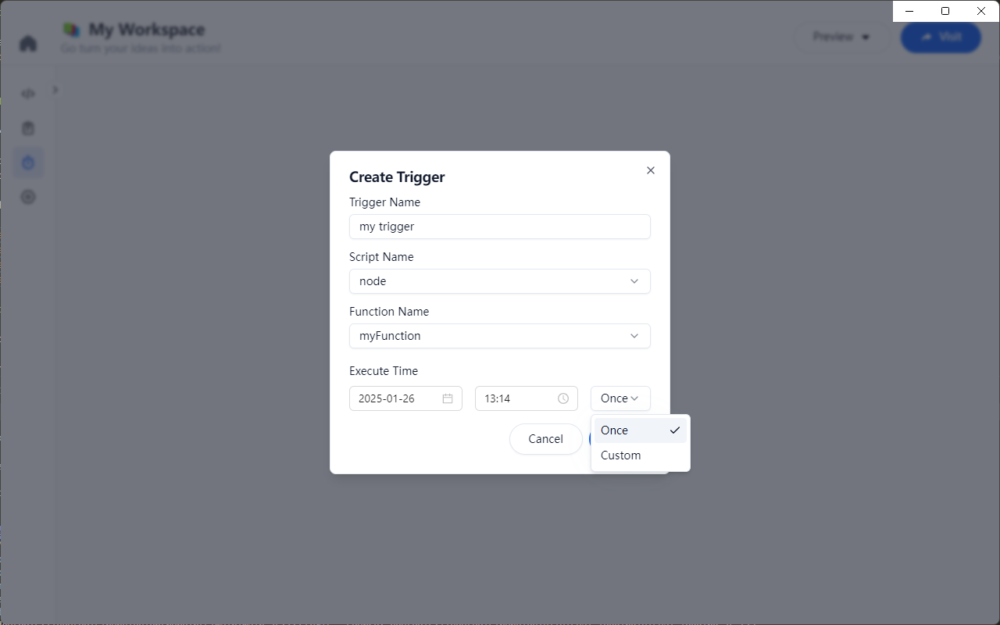
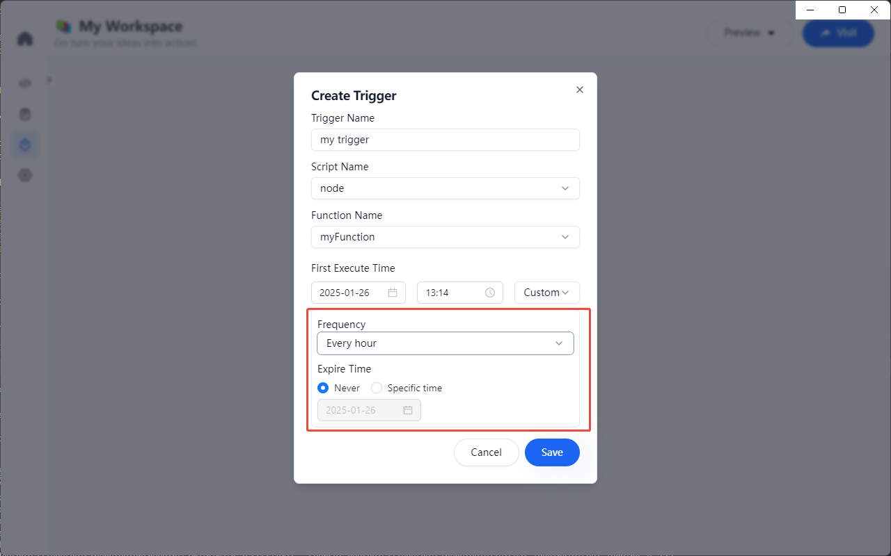
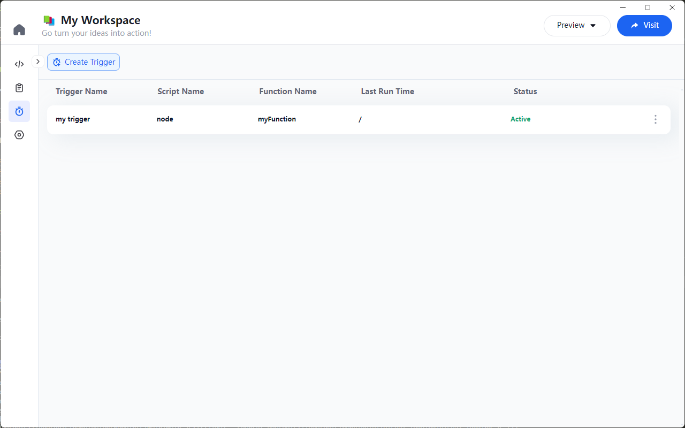
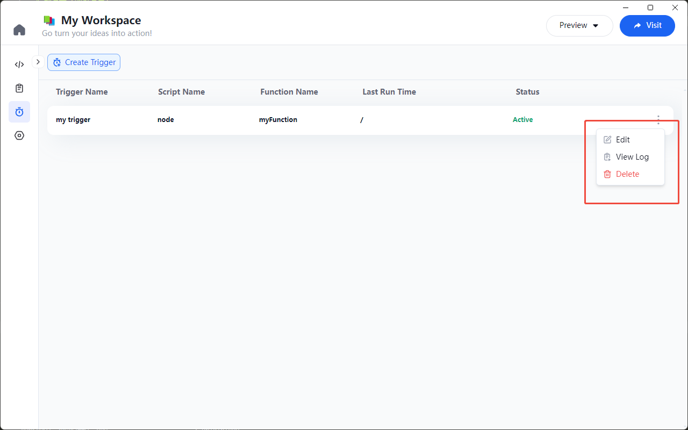

# 定时任务触发器

由于 Node Script 在 Node Runtime 执行后即时销毁的，我们可以在 Univer Go 中配置定时任务，通过定时任务触发 Uniscript 指定函数的执行，实现诸如定时创建报表、定时发送电子邮件等功能。

## 创建触发器

点击 Workspace 左侧 “触发器列表页” 标签，进入触发器列表页，在触发器列表页，通过点击“添加触发器”按钮，弹出“添加触发器”弹窗

在弹窗中填写触发器信息：
    - 填写触发器名称
    - 选择该 Workspace 下 Node Script 中的函数
    - 选择执行时间，包括制定日期触发一次，或者设置时间间隔多次触发
        - 设置特定日期，可以选择未来某个日期执行，精确到分钟
        - 设置时间间隔，支持配置每隔（小时、天、星期、月份、年）触发一次要执行的功能，并支持设置过期时间
    - 支持保存、取消，保存后触发器创建成功

| 触发信息 | 时间间隔 |
|---|---|
|  |  |

## 触发器列表

在触发器列表页，可以查看当前 Workspace 下的所有触发器，包括触发器名称、脚本名称、函数名称、最近运行时间、运行状态等信息。

支持修改、查看执行日志、删除触发器

