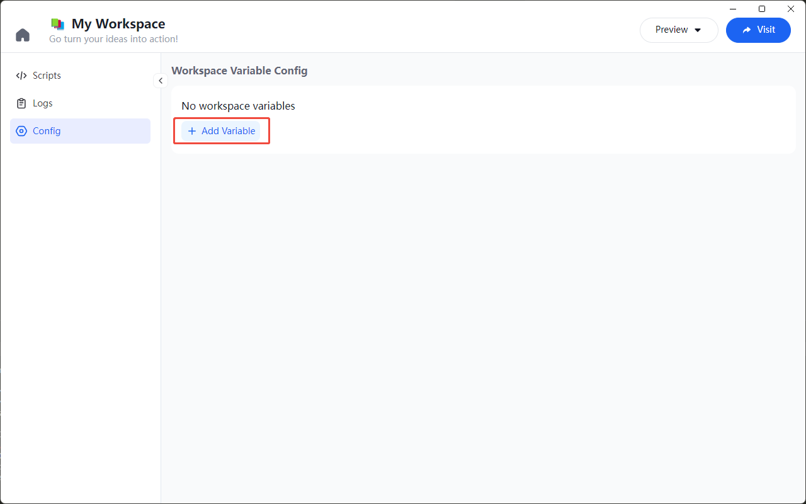
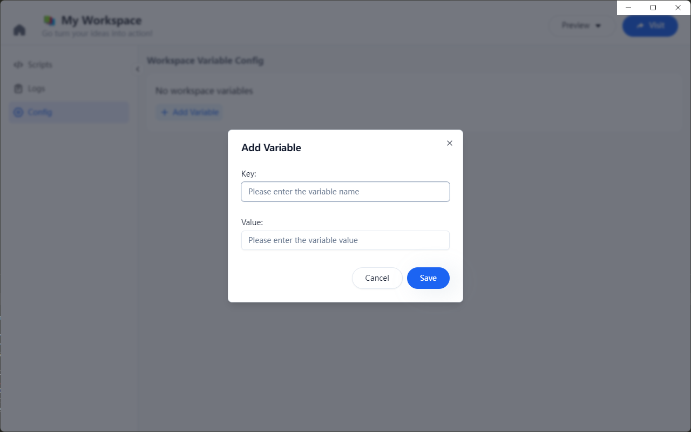
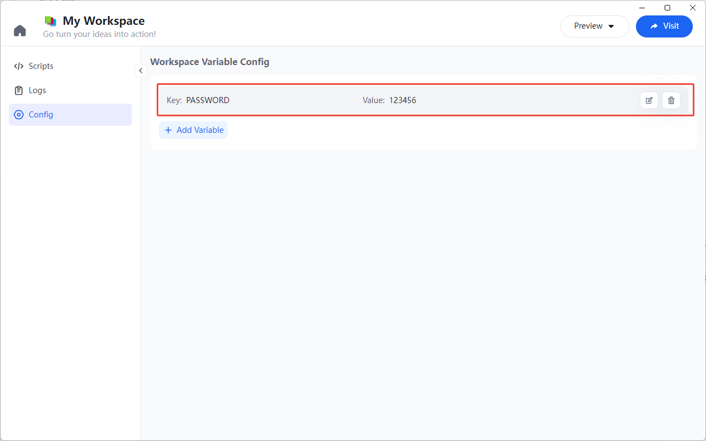
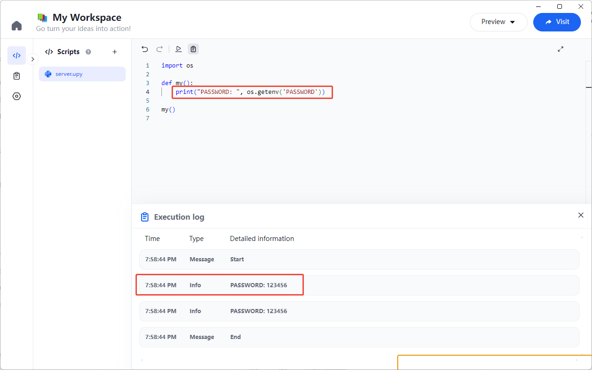

# 工作区变量

对于一些敏感信息，如数据库密码、API 密钥等，用户可以在工作区变量中设置，以保证安全性，不会暴露在脚本中，并且可以在不同的脚本中共享使用。

## 添加工作区变量

在 Workspace 中点击左侧的“配置”标签，显示“工作区变量配置”，点击“添加变量”按钮，



输入变量名和变量值，点击“保存”即可添加成功。




## 管理工作区变量

可以在环境变量列表页管理，包括编辑、删除等操作。



## 使用工作区变量

在 Python 脚本中，可以通过 `os.getenv` 方法获取工作区变量的值。比如：

```python
import os

def my():
  print("model:", os.getenv('PASSWORD'))

my()
```



## 导入工作区变量

在未来的版本中，我们将支持导入工作区变量到脚本中，方便用户使用。需要满足以下 JSON 格式：

```json
[
  {"scopeType": 1, "key": "key-name", "val": "不可导出的值置空", "desc": "what's this, how to set"},
  {"scopeType": 1, "key": "another-key-name", "val": "可有默认的配置值", "desc": "what's this, how to set"}
]
```
