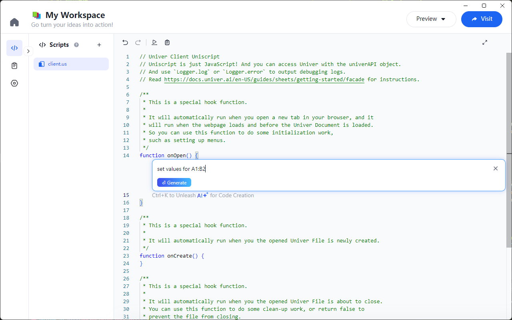
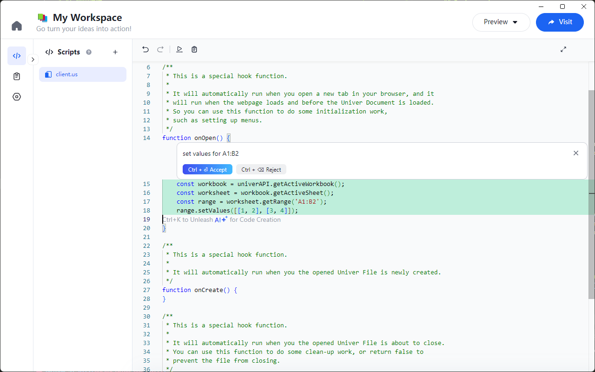

# AI 辅助编程

在扩展 Univer 应用时，使用 Univer API 可能会让很多开发者感到挑战，尤其是对于不熟悉 API 的开发者来说。传统上，我们需要频繁查阅官方文档，才能了解如何正确使用 API。为了简化开发过程，并提高开发效率，Univer Go 推出了 AI 辅助编写 Univer API 的功能，帮助开发者快速生成高质量的代码。

## 如何使用

在编辑器中，您可以使用快捷键来呼出 AI 对话框。对于 Windows 用户，按 `Ctrl + K`，对于 macOS 用户，按 `Command + K`。这样将会弹出一个对话框，输入您希望生成的代码的描述。例如，您可以输入：“给 A1:B2 设置一些值”，然后点击“生成”按钮。



稍等片刻，AI 将会根据您的需求生成相应的代码。以下是 AI 生成的一个示例代码：

```js
function setInitialValues() {
  const workbook = univerAPI.getActiveWorkbook();
  const sheet = workbook.getActiveSheet();
  const range = sheet.getRange('A1:B2');

  // 设置 2x2 范围的值
  range.setValues([
    [1, 2],
    [3, 4]
  ]);
}
```

检查生成的代码，并确认其正确性后，点击“接受”按钮，将其添加到您的 Script 中。


