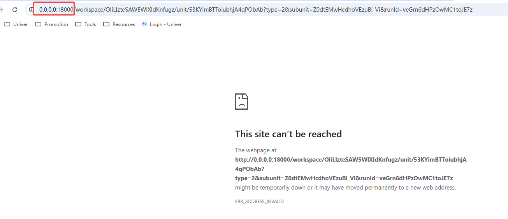
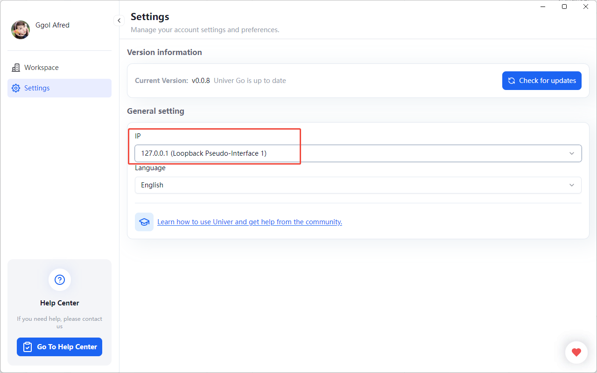

# 客户端环境问题

## 登录后提示 `Login failed Invalid session ticket`

  可能是网络代理影响，尝试关闭代理 或者 VPN。

## Windows 创建 Workspace 失败
    
  解决步骤：
  1. 全部卸载 Unier Go
  2. 重新安装 Univer Go 到 User 目录
  3. 允许网络访问权限

## 无法访问此网站

在预览 Workspace 时，可能会出现无法访问的情况，显示地址 `http://0.0.0.0:18000/`。

这时候需要在设置中重置 IP。

再次预览即可正常访问。
