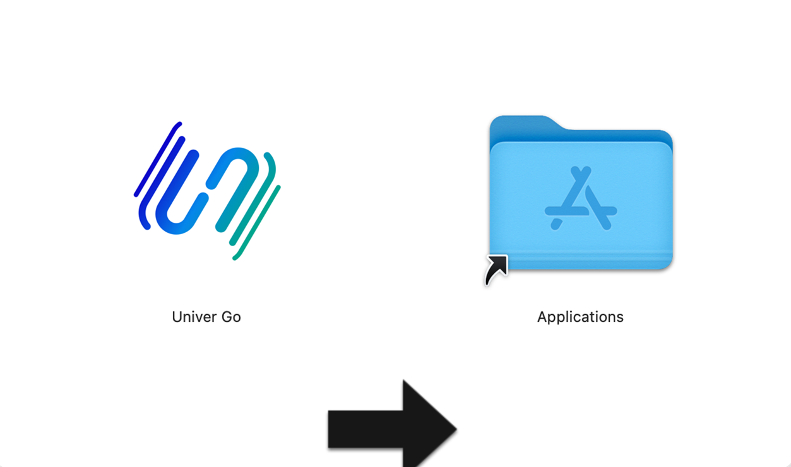
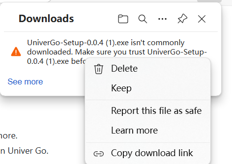
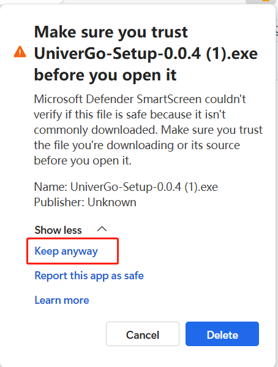
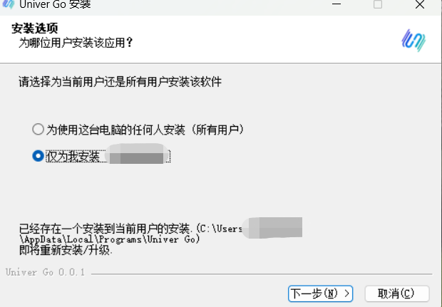
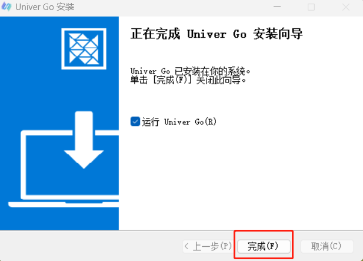

# 下载和安装

## Mac

### 步骤一：下载安装包

1. 访问 [下载地址](https://go.univer.ai)
2. 点击下载按钮，获取最新版本的安装包。

### 步骤二：开始安装

1. 拖拽安装已下载的包。
2. 完成安装后，启动 Univer Go 即可。

| 拖拽安装 |
|---|
|  |

## Windows

### 步骤一：下载安装包

1. 访问 [下载地址](https://go.univer.ai)
2. 点击下载按钮，获取最新版本的安装包。
3. 下载后右键文件菜单内点击 Keep，弹出弹窗后点击 Show less 后选择 Keep anyway，就可以完成安装。
    
    | Keep | Keep anyway |
    |---|---|
    |  |  |

### 步骤二：开始安装

1. 打开下载的安装文件。
2. 双击运行安装程序，并按照提示进行操作。
3. 选择安装路径（可以使用默认路径），点击“下一步”继续。
4. 等待安装完成，点击“完成”即可运行软件。

| 开始安装 | 安装完成 |
|---|---|
|  |  |

> 关于 Windows 安装和使用 Univer Go 的视频教程，可以参考 [此视频](https://youtu.be/Gvb8RKh-YXA)。
