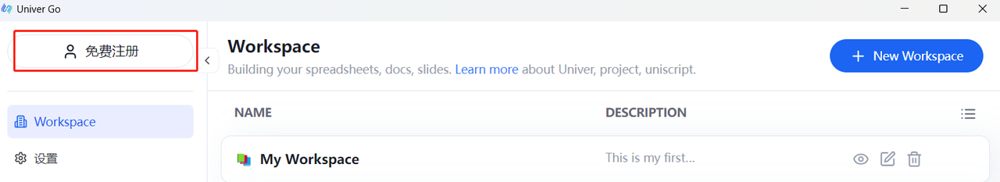
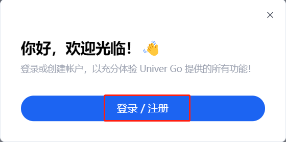
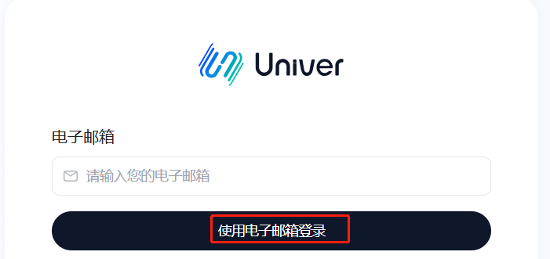
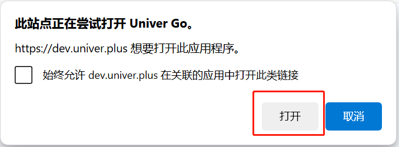
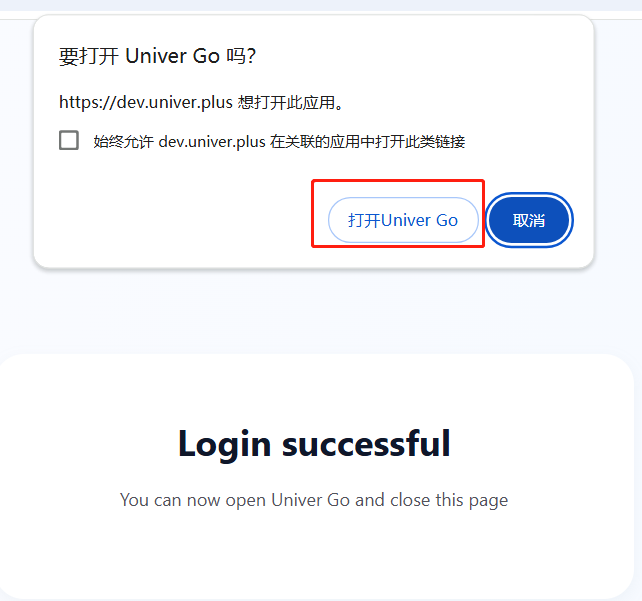

# 注册与登录

1. 打开 Univer Go，点击左上角的“免费注册”按钮。
  弹出登录/注册面板，点击后进入登录页面。
  | 免费注册 | 登录注册面板 |
  |---|---|
  |  |  |

2. 目前有两种登录方法，使用电子邮箱登录需要确保邮箱是可登录状态且能接收邮件。
  - 方法1：输入已注册的邮箱后点击“使用电子邮箱登录”。
    - 请在邮箱内找到 Univer 发送的邮件，并点击“Log in to Univer”。
    - 页面弹窗提示尝试打开 Univer Go，点击“打开”按钮，本次登录就成功了。
      | 电子邮箱登录 | 欢迎邮件 | 打开 Univer Go |
      |---|---|---|
      |  |  |  |
      
  - 方法2：使用 Google 登录
      - 浏览器已登录 Google 的用户：登录后跳转到登录成功页面，点击打开 Univer Go。
      - 浏览器未登录 Google 的用户：跳转到 Google 登录页面。
        - 先输入 Google 账号和密码登录。
        - 登录后跳转到登录成功页面，点击打开 Univer Go。
          
