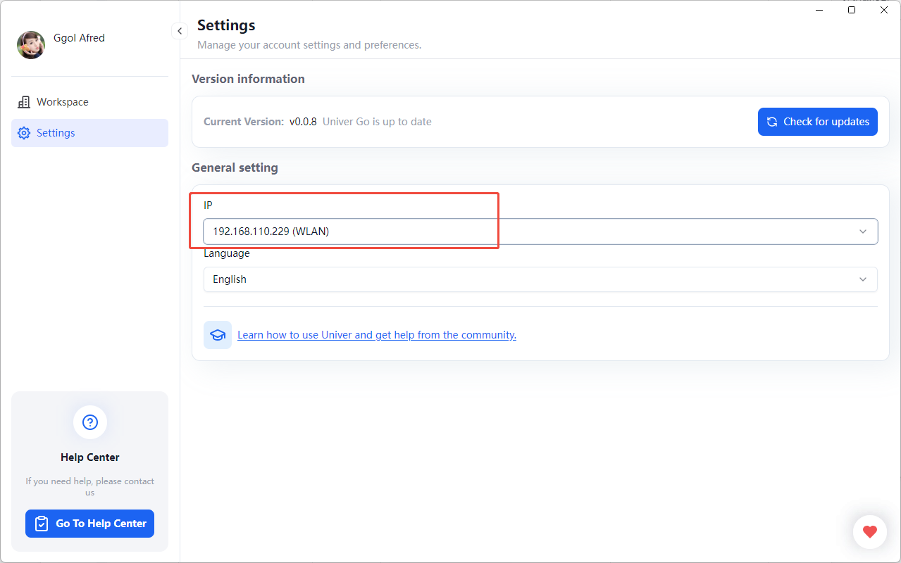
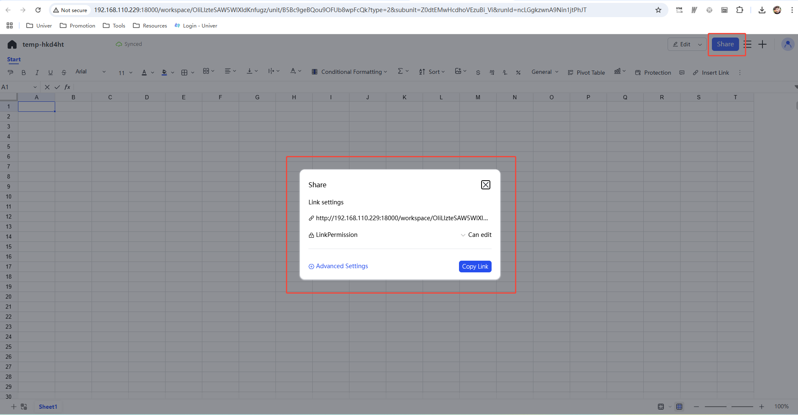

# 设置

## 语言设置

- 在 Univer Go 侧边栏点击设置，点击语言下拉框即可切换语言
 - 目前仅支持设置中文、英文

## 版本信息

- 点击检查更新按钮可查看当前是否为最新版本

## 局域网分享

Univer Go 允许用户在本地创建和分享工作空间（Workspace）。通过局域网（LAN），其他用户可以访问您的工作空间进行协同操作。为确保局域网内能够正常访问，用户需要设置正确的 IP 地址，并确保选择的 IP 地址在局域网中可用。

- **默认 IP 地址**: 如果用户没有手动设置 IP 地址，默认 IP 地址为 `127.0.0.1`，即只限本地访问。
- **自定义 IP 设置**: 用户可以在设置界面选择并设置一个局域网可用的 IP 地址。例如，选择适合局域网共享的 IP 地址，其他局域网用户可以通过该 IP 地址访问您的工作空间。
    

在 Workspace 预览时，点击右上角的“分享”按钮，会弹窗显示分享链接和权限设置。点击“复制链接”按钮，即可生成分享链接，其他同一局域网的用户可以通过该链接访问您的工作空间。

