# 基本使用

## 功能流程图

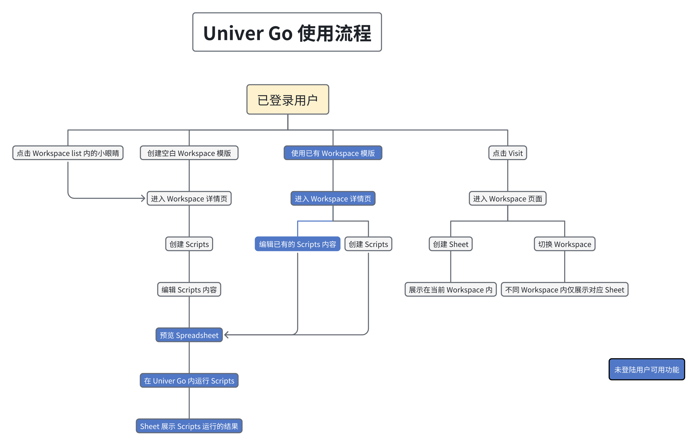

## 基础操作

### 步骤一：创建 Workspace

1. 点击右上角的 **New Workspace**
2. 创建空白 Workspace 或使用 Workspace 模板
3. 输入 **Name** 和 **Description** 后选择对应的 **Icon**
4. 点击 **Create** 后跳转到 Workspace 详情页
  | 创建 Workspace | Workspace |
  |---|---|
  | 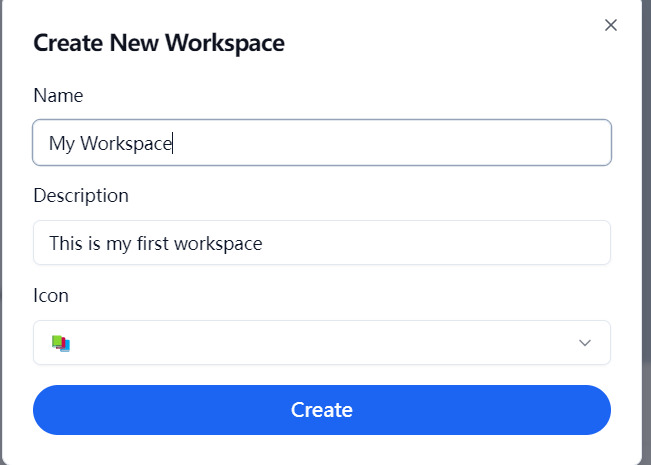 | 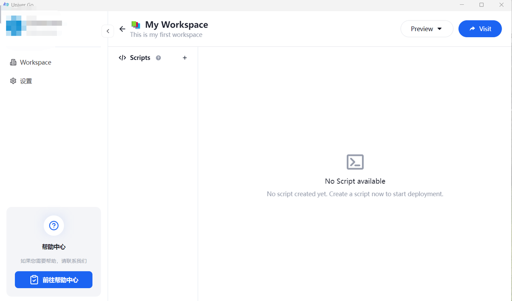 |

### 步骤二：创建 Script

#### 在 Workspace 详情页创建 Script
  - 创建时选择空白 Workspace，详情页为空
    1. 点击 Script 旁边的 **＋** 号可创建空白的 Script
    2. 在创建面板输入 **Script Name**，点击 **Script Type** 可选择两种不同的 Script
      - **Client Script**：自定义 UI 组件、事件处理、页面交互等
      - **Server Script**：连接 AI 代理、数据库和其他应用程序
        | Workspace | 创建 Script |
        |---|---|
        |  | 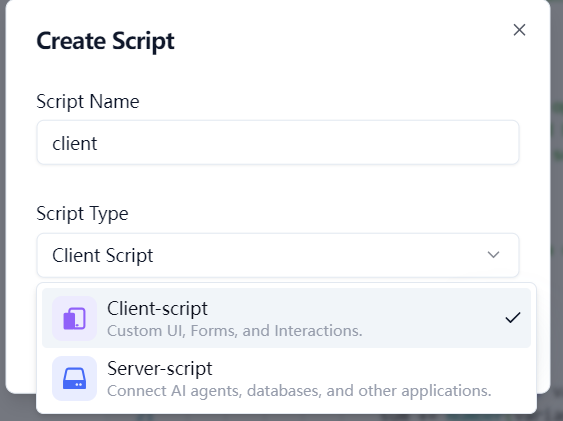 |

  - 创建时使用了模板的 Workspace，详情页有模板 Script
      
      点击 Script 旁边的 **＋** 号可创建空白的 Script
      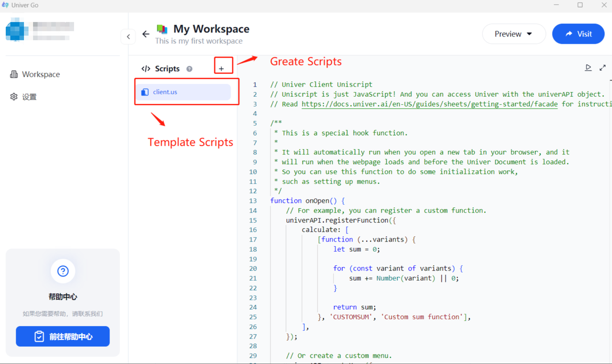

#### 修改 Script 和删除 Script
  点击 Script 旁的更多按钮修改 **Script Name** 或删除 Script
  | 修改 Script | 删除 Script |
  |---|---|
  | 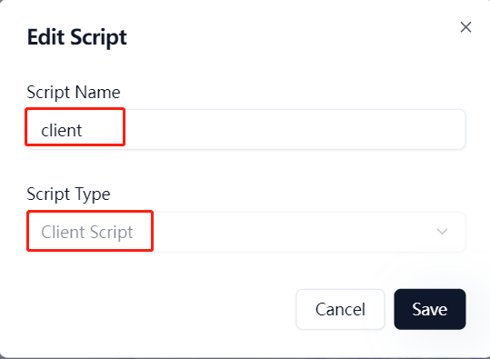 | 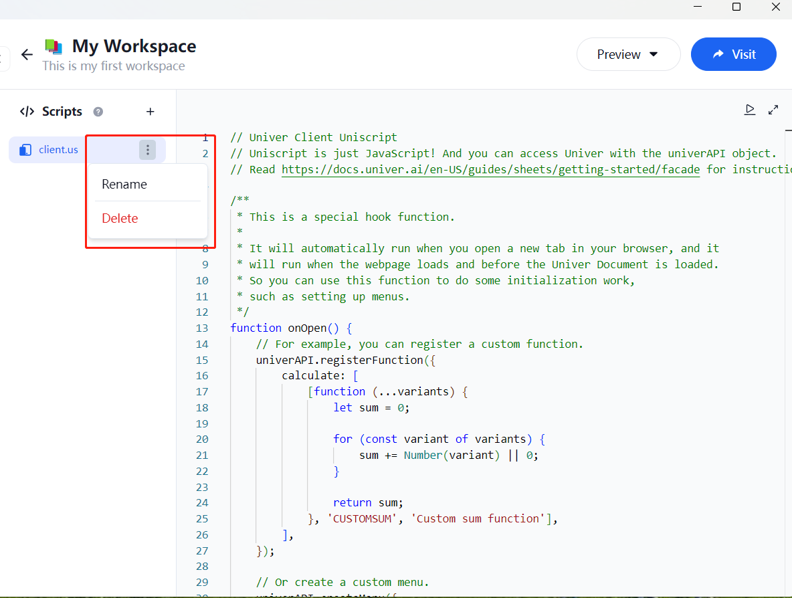 |

  > 无法修改已创建的 **Script Type**

### 步骤三：运行 Script

1. 创建 Script 后点击右侧编辑区域，输入代码
  - 可以点击右上角的全屏按钮，将编辑区域放大
  - 点击 **ESC** 可退出全屏
    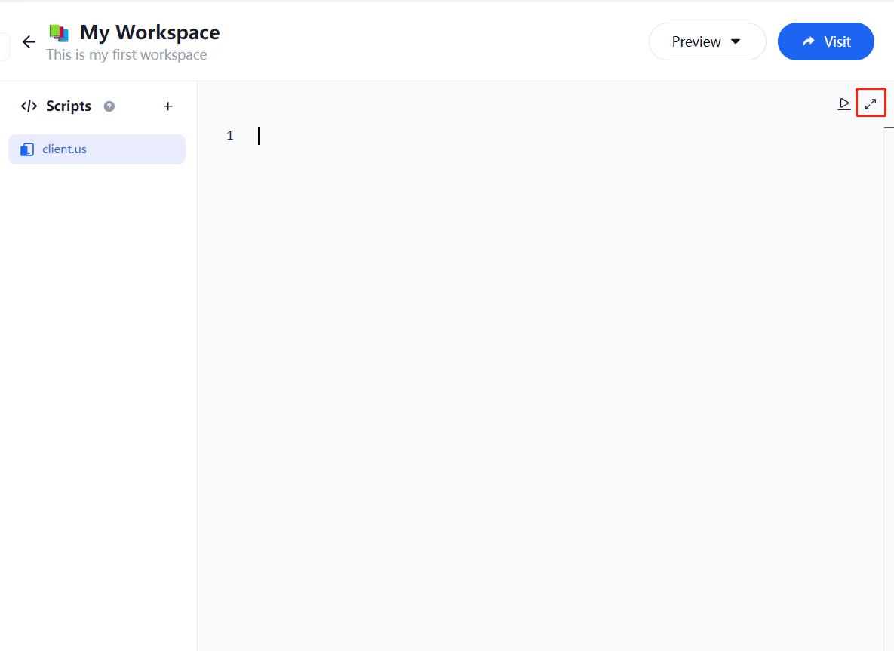

  > Uniscript 教程请参考 [Univer 官方文档](https://docs.univer.ai/zh-CN/guides/sheets/features/core/general-api)

2. 代码编写完成后，点击右上角的 **Preview**，选择 **Spreadsheet**
  选择后会打开一个 sheet 文档，运行后的效果会展示在文档内
  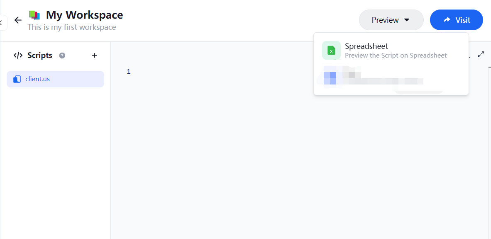

3. 点击运行时会有多个选项：
  - **onOpen**：每次打开 Unit 文档时自动触发
  - **onCreate**：首次创建并打开 Unit 文档时自动触发，在 **onOpen** 之前
  - **onClose**：每次关闭 Unit 文档时自动触发
  - **myFunction**：自定义的函数名称，可以根据需要修改或扩展它的内容

4. 点击对应的选项即可运行
  - 运行成功与失败均有提醒
  - 通过右上角 **Visit** 打开的 Workspace 内不会保留本次运行的文档
    | 运行成功 | 运行失败 |
    |---|---|
    |  |  |

### 步骤四：点击 Visit

1. 在详情页内点击 **Visit**
  1. 打开对应 Workspace 主页
  2. 该主页仅展示当前 Workspace 已创建或上传的文档
      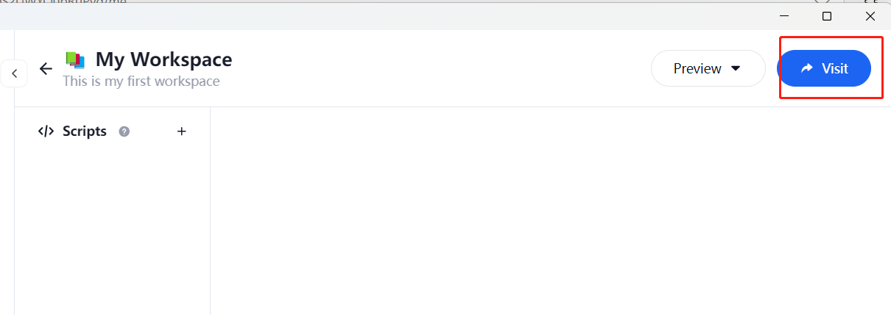

2. 在主页内创建文档与删除文档
  1. 文档仅保留在该 Workspace 内
  2. 删除 Univer Go 中的 Workspace 时，文档也会消失，无法恢复
  3. 删除主页内的文档不会影响 Univer Go
      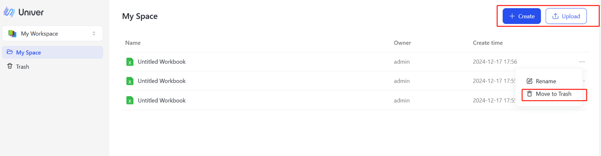

3. 在主页切换 Workspace
  1. 点击右上角按钮可以查看到所有的 Workspace，支持切换不同的 Workspace
  2. 不同的 Workspace 仅展示当前 Workspace 内手动创建和上传的文档
  3. 当在 Univer Go 内编辑或删除 Workspace 时，需要刷新页面以同步最新修改
    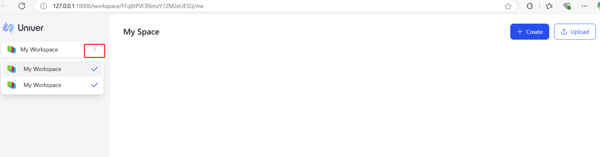

### 步骤五：查看 Workspace 列表

1. 点击侧边栏的 **Workspace**，展示所有已创建的 Workspace
  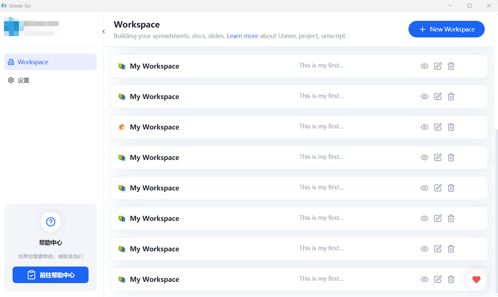

2. 点击 Workspace 后的小眼睛图标，进入 Workspace 详情页
  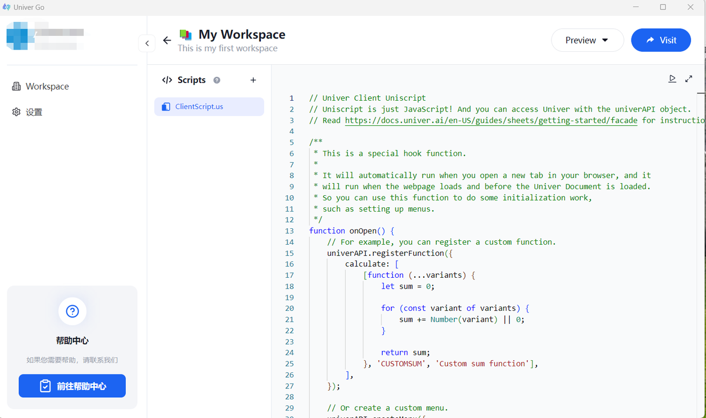

3. 点击 Workspace 后方的编辑按钮，支持修改 **Name**、**Description** 和 **Icon**
  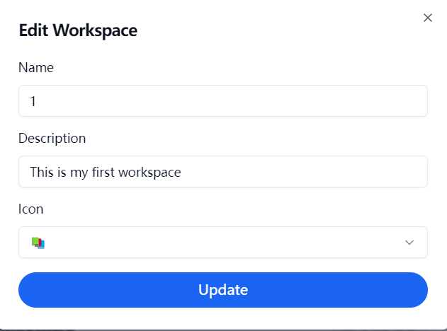

4. 点击 Workspace 后方的删除按钮。删除后的 Workspace 无法恢复，请谨慎操作
  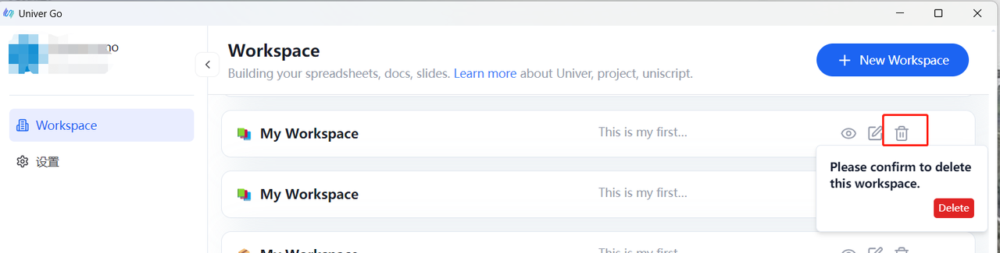
