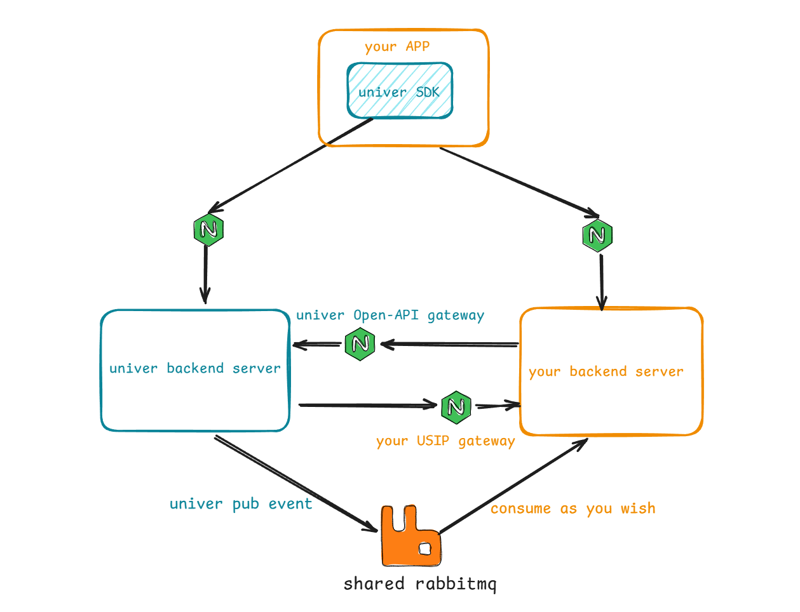

# 集成概述

为什么需要和你的系统进行集成？

在 `快速体验` 后，你已经体验了 Univer 服务端提供的能力，你应该已经发现：体验版本为何所有人都不需要登录即可随意使用？如果你希望需要用户登录才能使用，并且可以管理用户的权限（我创建的文档别人不能阅读，除非我给他们添加了阅读/编辑授权），要怎么实现呢？有人评论了你的文档，你如何得到邮件/IM 通知呢？如何通过自己的后端服务来操作所有的文档资源呢？

要实现这些能力，都需要将 Univer 后端服务与你的系统进行集成。Univer 设计了以下 3 种方式来满足你的这些需求：

- USIP（一种 SPI）：已实现部分接口
- OpenAPI：正在设计中，后续会逐步推出
- Univer 事件同步：已支持部分事件

下图描述了 Univer 与你的系统集成下的部署架构：

接下来将分子章节来介绍上述集成方式的细节
- [通过 USIP 与你的系统集成](/guides/sheets/pro-features/server/integrate-usip)
- [通过 Univer 事件同步机制与你的系统集成](/guides/sheets/pro-features/server/event-sync)
