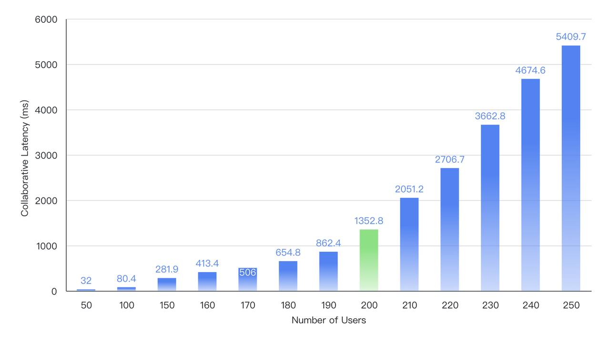

# 性能报告

## 从内存中加载数据快照

| 工作簿单元格数量 | 时间（秒） |
| --- | --- |
| 1M (100,000 行, 10 列) | 0.274 |
| 1M (10,000 行, 100 列) | 0.241 |
| 10M (1,000,000 行, 10 列) | 1.520 |
| 10M (100,000 行, 100 列) | 0.945 |

## 公式计算

| 公式复杂度 | 完成计算时间（秒） |
| --- | --- |
| 20,000 个公式，随机引用范围 | 1.32 |
| 20,000 个嵌套公式 | 1.37 |
| 20,000 个公式，带 VLOOKUP 函数 | 4.73 |
| 20,000 个公式，带嵌套求和函数 | 1.38 |

## 渲染性能

测试机器配置：Windows 操作系统，配备 32GB 内存，i9-13900H CPU 的笔记本电脑。

| 单元格数量 |  滚动时的 FPS |
| --- | --- |
| 100k (10k 行, 10 列) | 50 ~ 60 |
| 200k (20k 行, 10 列) | 50 ~ 60 |
| 1m (100k 行, 10 列) | 50 ~ 60 |
| 6m (600k 行, 10 列) | 50 ~ 60 |

## 数据透视表性能

测试机器配置：macOS 操作系统，配备 Apple Silicon M2 Pro CPU 的 MacBook Pro。

| 单元格数量 | 读取表格数据时间（秒） | 执行查询时间（秒） |
| --- | --- | --- |
| 500k (1 透视行维度, 1 透视列维度, 2 值维度) | 0.252 | 0.040 |
| 1M (1 透视行维度, 1 透视列维度, 2 值维度) | 0.376 | 0.078 |
| 2M (1 透视行维度, 1 透视列维度, 2 值维度) | 0.732 | 0.140 |
| 5M (1 透视行维度, 1 透视列维度, 2 值维度) | 3.200 | 0.415 |

## 转换 Office 格式文件性能

测试机器配置：Linux 操作系统，配备 8 GB 内存以及 Intel(R) Xeon(R) Platinum 8369B @ 2.90GHz 4 核 CPU 的云服务器。

| 单元格数量 | 文件体积 | 导入 .xlsx 格式耗时（秒） | 导出 .xlsx 格式耗时（秒） |
| --- | --- | --- | --- |
| 50k (1,000 行 / 25 列 / 2 子表) | 0.5M | 0.04 | 0.23 |
| 500k (2,500 行 / 50 列/ 4 子表) | 5.4M | 1.22 | 2.5 |
| 1M (5,000 行 / 25 列 / 8 子表) | 11M | 2.39 | 5.1 |
| 5M (10,000 行 / 50 列 / 10 子表) | 55M | 11.3 | 25.3 |
| 10M (200,000 行 / 50 列 / 1 子表) | 110M | 34.4 | 54.9 |

## 协同编辑

Univer 协同引擎在确保稳定性和可靠性的同时表现出色。在 4C8G 服务器上的基准测试结果如下：在处理 200 个并发用户时，成功将协同延迟维持在约 1.3 秒，接近业界主流产品水平。

